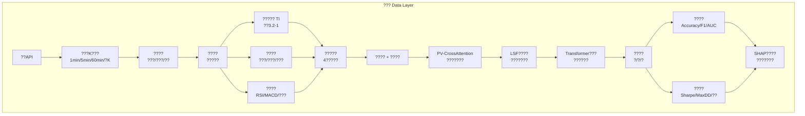

# ? 1.2-1 ?????????

## Mermaid ????? Draw.io ????

## Draw.io ????

1. ?? https://app.diagrams.net/
2. ?????
3. ???? **Arrange ? Insert ? Advanced ? Mermaid**
4. ???? Mermaid ??
5. ???????? PNG (300dpi)
6. ??? `outputs/ch1/figures/fig_1.2-1_research_framework.png`

## ????

| ?? | ?? | HEX |
|------|------|-----|
| ??? | ?? | #e3f2fd |
| ??? | ?? | #e8f5e9 |
| ??? | ?? | #fff3e0 |
| ??? | ?? | #fce4ec |
