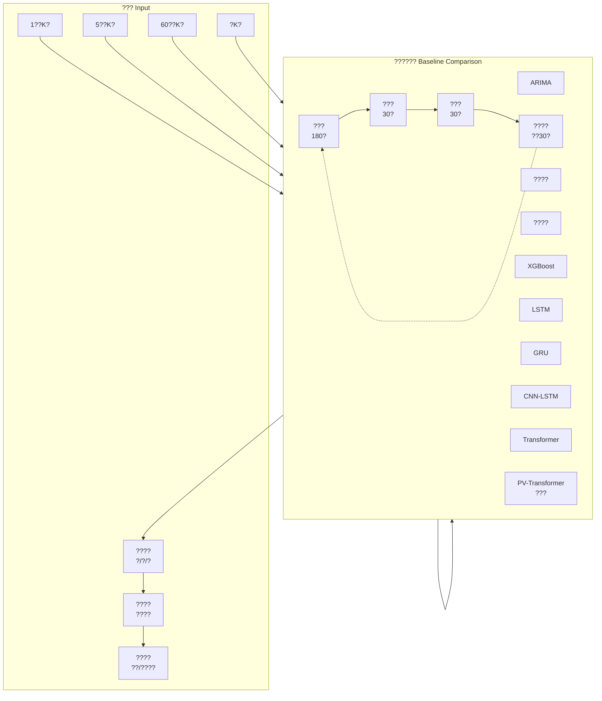

# ? 1.2-2 ????????????

## Mermaid ??



## ?????????

```
??? ??????????????????????????????????????????????????????????

?1?: [====??180?====][??30?][??30?]
?2?:        [====??180?====][??30?][??30?]
?3?:               [====??180?====][??30?][??30?]
...
```

## Draw.io ????

1. ?? https://app.diagrams.net/
2. ?? **Arrange ? Insert ? Advanced ? Mermaid**
3. ?? Mermaid ??
4. ??? `outputs/ch1/figures/fig_1.2-2_experiment_design.png`
