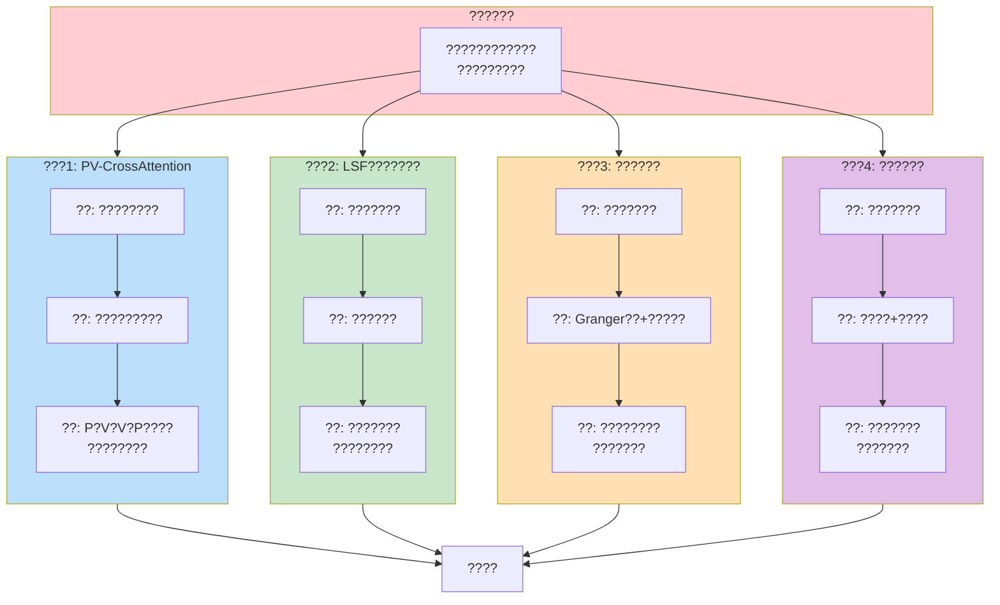

# ? 1.3-1 ??????????

## Mermaid ??

## ????

| ?? | ?? | ?? |
|------|------|------|
| ???? | ?? #ffcdd2 | ???? |
| ???1 | ?? #bbdefb | ?????? |
| ???2 | ?? #c8e6c9 | ?????? |
| ???3 | ?? #ffe0b2 | ?????? |
| ???4 | ?? #e1bee7 | ????? |

## Draw.io ????

1. ?? https://app.diagrams.net/
2. ?? **Arrange ? Insert ? Advanced ? Mermaid**
3. ?? Mermaid ??
4. ??? `outputs/ch1/figures/fig_1.3-1_innovation_framework.png`
