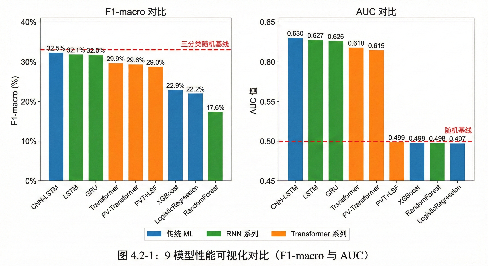

基于深度学习的港股分钟级价格预测研究——多模型对比与实证分析

## 摘要

股票价格预测是金融学与计算机科学交叉领域的核心问题之一。随着量化交易的普及与算法交易技术的日趋成熟，市场参与者对短期价格变动预测的精度和时效性提出了更高要求。相比传统的日频预测，分钟级预测能够捕捉日内的供需变化与市场微观结构信号，在信息粒度和策略可操作性上具有独特优势，为日内交易决策提供了更为精细的支撑。然而，现有研究在分钟级预测领域存在两方面不足：其一，多数工作集中于日频数据或对单一模型的孤立验证，缺乏在统一实验条件下对不同代际技术路线的系统对比；其二，深度学习模型常被视为"黑盒"，预测依据的可解释性问题尚未得到充分关注。

针对上述不足，本文以香港交易所恒生指数10只成分股为研究对象，采集2021至2026年间的多尺度K线数据（涵盖1分钟、5分钟、60分钟和日线四个周期），构建了覆盖三代技术路线共9种模型的对比实验框架：传统机器学习方面选取逻辑回归、随机森林和XGBoost作为基准模型；RNN系列选取LSTM、GRU和CNN-LSTM；Transformer系列则在标准Transformer基础上，进一步设计了融合量价交叉注意力机制的PV-Transformer以及引入可学习尺度融合模块的多尺度模型。在特征工程层面，本文围绕量价关系、技术指标、动量信号和市场状态四个维度构建了多维度特征体系，并采用分位数自适应标签策略解决不同标的间波动率差异导致的类别不均衡问题。所有模型在相同的静态时序划分、特征集与评估协议下进行训练和测试，从统计精度和经济价值两个维度综合评估性能。在可解释性方面，本文将SHAP归因分析与Granger因果检验相结合，从"相关性"与"因果性"两条独立路径交叉验证模型的预测依据，并进一步分析预测能力的时变特征与市场状态依赖性。

实证结果表明，深度学习模型在概率排序与方向预测能力上优于传统机器学习模型，该差异经非参数统计检验确认具有统计显著性。在深度学习内部的横向比较中，基于门控记忆机制的RNN系列在本文的实验条件下整体表现优于Transformer系列，这一结果可能与分钟级短序列的数据特点有关，但不宜简单推广至其他数据规模或预测场景。模拟回测显示，深度学习策略在零交易成本条件下取得了较高的风险调整收益，但引入实际交易成本后各模型的盈利空间均被大幅压缩，说明交易成本是分钟级策略实际部署中的关键约束。可解释性分析揭示，成交不平衡类特征在SHAP归因和Granger因果检验中均表现为最具预测力的信号类别，与订单流不平衡驱动短期价格变动的金融理论相吻合，两条独立证据的交叉验证增强了预测机制的可信度。此外，特征预测力随预测步长呈现系统性衰减，模型性能在不同市场波动状态下表现出明显的异质性，这些发现对模型的实际部署条件和更新策略具有一定的参考价值。

**关键词**：深度学习；股价预测；分钟级K线；多模型对比；港股；SHAP可解释性；Granger因果检验；多尺度融合

## Abstract

Stock price prediction is a central problem at the intersection of finance and computer science. With the proliferation of quantitative trading and the maturation of algorithmic trading, market participants increasingly demand higher accuracy and timeliness in short-term price movement forecasting. Compared with traditional daily-frequency prediction, minute-level prediction captures intraday supply-demand dynamics and market microstructure signals, offering unique advantages in information granularity and strategic operability that provide more refined support for intraday trading decisions. However, existing research on minute-level prediction has two notable gaps: first, most studies focus on daily-frequency data or isolated validation of individual models, lacking systematic comparisons across different generations of techniques under unified experimental conditions; second, deep learning models are often treated as "black boxes," and the interpretability of their predictions has not received sufficient attention.

To address these limitations, this study selects 10 Hang Seng Index constituent stocks from the Hong Kong Exchange as research subjects and collects multi-scale K-line data from 2021 to 2026, covering four time scales: 1-minute, 5-minute, 60-minute, and daily. A comparison framework encompassing 9 models across three generations of techniques is constructed: Logistic Regression, Random Forest, and XGBoost serve as traditional machine learning baselines; LSTM, GRU, and CNN-LSTM represent the RNN family; and the Transformer family includes a standard Transformer, a PV-Transformer incorporating price-volume cross-attention, and a multi-scale model with a learnable scale fusion module. Feature engineering is organized around four dimensions—volume-price relationships, technical indicators, momentum signals, and market state—and a quantile-adaptive labeling strategy is employed to address class imbalance arising from volatility differences across stocks. All models are trained and evaluated under identical static temporal splits, feature sets, and evaluation protocols, with performance assessed from both statistical accuracy and economic value perspectives. For interpretability, this study combines SHAP attribution analysis with Granger causality testing to cross-validate predictive mechanisms through two independent approaches, and further examines the time-varying characteristics and market-state dependence of predictive power.

Empirical results show that deep learning models outperform traditional machine learning in probabilistic ranking and directional prediction, with the difference confirmed as statistically significant by non-parametric testing. In lateral comparison within deep learning, gated-memory RNN models exhibit overall better performance than Transformer-based models under the experimental conditions of this study, a result likely related to the characteristics of short minute-level sequences that should not be simply generalized to other data scales or prediction scenarios. Simulated backtesting reveals that deep learning strategies achieve higher risk-adjusted returns under zero transaction costs, but profitability across all models is substantially compressed after incorporating realistic transaction costs, indicating that transaction costs constitute a critical constraint for practical deployment of minute-level strategies. Interpretability analysis reveals that trade imbalance features emerge as the most predictive signal category in both SHAP attribution and Granger causality testing, consistent with the financial theory that order flow imbalance drives short-term price movements; the cross-validation of two independent lines of evidence strengthens the credibility of the predictive mechanism. Furthermore, predictive power decays systematically with forecast horizon, and model performance exhibits notable heterogeneity across market volatility regimes—findings that offer practical guidance for model deployment conditions and update strategies.

**Keywords**: Deep Learning; Stock Price Prediction; Minute-level K-line; Multi-model Comparison; Hong Kong Stock Market; SHAP Interpretability; Granger Causality; Multi-scale Fusion

# 第一章 绪论

## 第一节 研究背景与研究意义

### 一、分钟级价格预测的研究现状与挑战

股票价格预测一直是金融学与计算机科学交叉领域的核心问题。随着量化交易的普及与算法交易技术的成熟，对短期价格变动的精准预测已成为学术研究与业界实践的共同关切。

从预测时间尺度来看，现有研究主要集中在日频与分钟频两个层次。日频预测（如次日收盘价涨跌）是传统技术分析与机器学习研究的主战场，彭燕等（2019）基于两层LSTM网络在日频股价预测中将RMSE较MLP基线降低了0.164，李晨阳（2021）利用CNN-LSTM在上证50成分股上实现了56.04%的涨跌预测准确率。然而，日频预测的实际应用价值有限：一方面，日频模型无法捕捉日内的剧烈波动；另一方面，日频信号难以为日内交易策略提供足够的决策支持。

分钟级预测填补了日频与Tick级之间的空白，具有独特的研究价值与实践意义。首先，分钟级数据的获取成本远低于Tick级限价订单簿数据，多数券商API均可提供历史K线回溯，数据可得性显著提升。其次，分钟级预测为日内交易策略（如趋势跟踪、均值回复）提供了可操作的时间窗口，5-30分钟的预测视野与实际交易决策周期相匹配。最后，分钟级数据在保留日内波动信息的同时过滤了Tick级的微观噪声，信噪比相对较高。

然而，分钟级价格预测面临三个核心挑战：（1）**非平稳性**：金融时间序列的统计特性随时间快速变化，传统静态模型容易失效；（2）**低信噪比**：价格的短期波动受随机因素影响大，有效信号难以从噪声中分离；（3）**多尺度依赖**：短期价格变动同时受分钟级供需失衡与中长期趋势的共同影响，单一时间尺度难以全面刻画。

### 二、多尺度信息融合的重要性

金融市场的价格形成是多时间尺度信息综合作用的结果。短周期内的价格波动反映瞬时的供需失衡，而中长期趋势则体现基本面与市场情绪的演变。传统预测模型通常仅使用单一时间尺度的数据，忽视了不同周期信息的互补性。

从理论层面看，多尺度分析在时间序列预测领域已有深厚基础。小波分解通过将原始序列拆分为不同频率成分，能够分离趋势与噪声。李梦等（2023）的研究表明，小波分解后的低频序列"噪声降低，平稳性提升，有助于模型拟合预测"。另一种更直接的思路是绕过信号分解，直接将不同周期的K线数据作为并行输入，由模型自动学习各尺度之间的信息融合。

将多尺度思想迁移至金融时序预测具有天然的合理性。1分钟K线能够捕捉瞬时的供需变化与微观结构信号，但噪声较大；5分钟K线平滑了部分噪声，反映短期动量与趋势形成；60分钟K线反映日内的主要波段与趋势方向；日K线则体现中长期趋势与市场整体情绪。通过同时输入多个时间尺度的特征，模型能够根据不同市场状态自适应地调整对各尺度信息的关注权重——在趋势明确时更多依赖长周期信号，在震荡市中则更多参考短周期的供需失衡信息。这种多尺度融合策略在理论上有助于缓解单尺度模型的信息局限性，但其实际效果取决于多尺度数据的可用性与模型的学习能力。

### 三、从传统方法到深度学习：股价预测技术的三代演进

股价预测方法经历了从传统统计模型到机器学习、再到深度学习的三代技术演进，每一代方法在建模能力上实现了显著跃升，同时也面临各自的局限。

**第一代：传统统计方法**：以ARIMA为代表的时间序列模型将价格视为线性随机过程，通过参数化方式捕捉自相关结构。吴玉霞和温欣（2016）的研究表明，ARIMA模型在短期股价预测中能够达到较高精度（平均相对误差约1.35%），但其适用前提是序列的平稳性与结构稳定性。张旭东（2020）尝试用隐马尔可夫模型（HMM）建模价格状态的离散转移，在A股个股预测中表现优于SVM，但仍局限于收益率单一特征的建模。传统统计方法的共性短板在于：特征表示单一、非线性拟合能力受限、且对平稳性假设依赖较强。

**第二代：机器学习方法**：以随机森林、XGBoost为代表的集成学习方法突破了线性假设，能够自动发现特征间的复杂交互关系。邓晶和李路（2020）的研究表明，经过参数优化的随机森林在A股涨跌预测中准确率达到77%、AUC达到0.85。王燕和郭元凯（2019）发现，经网格搜索优化的XGBoost在短期收盘价预测中拟合度极高。然而，机器学习方法仍存在两方面不足：其一，特征表示依赖人工设计，技术指标需要研究者基于领域知识预先构造；其二，决策树类模型本质上是静态映射，难以显式刻画时间序列的长程依赖关系。

**第三代：深度学习方法**：长短期记忆网络（LSTM）通过门控机制解决了传统RNN的梯度消失问题，能够自动从原始序列中学习时序特征表示。彭燕等（2019）的研究表明，两层LSTM网络在股价预测中RMSE较传统MLP降低0.164。在此基础上，CNN-LSTM等混合架构进一步融合了空间特征提取与时序建模能力：李晨阳（2021）的CNN-LSTM模型在上证50成分股上涨跌预测准确率达56.04%，高于单一CNN（54.15%）与LSTM（53.13%）。Shen and Shafiq（2020）在S&P 500个股的二分类（涨/跌）预测中发现，基于LSTM的深度学习系统准确率达93.25%，高于随机森林基线的88%。该结果基于二分类任务，与本文的三分类设定（涨/跌/平）存在差异，但其结论——深度学习在时序预测中优于传统机器学习——仍具参考价值。

深度学习内部同样存在技术路线的分化。第一类是RNN系列（LSTM、GRU及其混合架构），通过门控记忆机制沿时间步逐步传递信息，适合对短期时序的连贯建模。李潇俊和唐攀（2021）构建的混合循环神经网络（LSTM+GRU）证明了动态调整网络结构能进一步降低预测误差；赵红蕊（2023）的LSTM-CNN-CBAM模型通过引入通道注意力机制，将上证指数预测的RMSE从单一LSTM的0.1901降至0.0278。第二类是Transformer架构（Vaswani et al., 2017），通过自注意力机制在任意两个时间步之间直接建立关联，无需递归传递。Zhang and Yan（2023）提出的Crossformer利用跨维度依赖建模多变量时间序列，在长期预测中优于传统Transformer变体。

两类深度学习架构各有适用场景：RNN系列的门控记忆机制能产生连贯的序列输出，适合趋势跟踪类策略，但顺序计算方式限制了长序列训练效率；Transformer的并行计算特性使其在长序列训练中具有效率优势，且自注意力机制能自动识别历史时点中的关键事件，但其在金融时序上是否稳定优于RNN系列尚无定论——金融时序的低信噪比与非平稳性可能削弱自注意力机制的优势。本文将上述三代技术路线在同一数据集上进行系统对比，以实证方式验证深度学习相较于传统机器学习的优势边界，并检验深度学习内部不同架构的相对表现。

### 四、研究市场选择

本文选择港股市场作为研究对象，除数据可得性外，更重要的原因在于港股独特的交易制度为分钟级预测研究提供了理想的实验场景。

港股的交易制度具有若干独特之处，使其成为分钟级预测研究的理想市场。在交易机制方面，港股实行T+0制度，允许当日买入当日卖出，投资者可即时对价格信号做出反应，模型输出的5-30分钟预测可立即转化为交易决策，无需像A股T+1制度那样等待次日执行。在价格形成方面，港股正股无涨跌幅限制，价格能够充分反映市场供需，极端行情下模型仍可正常运作，价格序列的连续性更好，不存在因涨跌停板而产生的人为断点。在市场结构方面，港股作为连接内地与国际市场的枢纽，同时受A股情绪、美股走势与国际资金流动的多重影响，这种多元驱动的市场环境对预测模型的泛化能力提出了更高要求。此外，港股的市场微观结构兼具做市商与竞价撮合双重特征，与A股的纯竞价制度和美股的多做市商制度均有所不同。Wei et al.（2013）指出不同市场微观结构对订单流信息含量的影响存在差异，这意味着在特定市场得到的结论未必可以直接推广。港股作为亚太地区国际化程度较高的市场，其研究结论对理解不同微观结构下预测模型的适用性具有补充价值。

综合来看，港股市场为本文提供了理想的实验环境：T+0制度保障预测信号的可执行性，无涨跌停保障价格序列的连续性，国际化特征保障研究结论的可推广性。

### 五、研究意义与实践价值

本文聚焦于港股市场的分钟级价格预测，选取恒生指数权重前10的成分股作为研究对象，兼具理论意义与实践价值。

在理论层面，本文系统性地比较了传统机器学习、RNN系列与Transformer系列共9种模型在港股分钟级预测任务中的表现，重点验证深度学习相较于传统机器学习的优势边界；同时探索多尺度特征融合与量价交叉注意力机制的可行性与局限性；结合SHAP归因与Granger因果检验，为模型预测提供多维度的可解释性分析。

在实践层面，本文的预测框架可为日内交易策略提供5-30分钟预测视野的决策支持，充分利用港股T+0制度的灵活性。SHAP归因分析输出的特征重要性排序可指导量化策略的特征选择与优化。多模型对比框架与分析方法可为其他市场（A股、美股）的类似研究提供参考。

## 第二节 研究框架与思路

### 一、总体研究框架

本文遵循"数据驱动—特征工程—模型构建—实证评估"的系统化范式，构建了一个面向分钟级K线数据的端到端预测框架，系统比较传统机器学习、RNN系列与Transformer系列共9种模型在港股分钟级预测任务中的表现（模型的具体选取与配置详见第三章第四节）。

**1. 多尺度K线数据获取与预处理**：本文使用富途API获取港股多尺度K线数据（1min/5min/60min/日K），经时间对齐、异常值处理与前复权调整后用于建模。数据获取与预处理的技术细节详见第三章第一节。

**2. 多尺度特征工程**：特征工程是连接原始数据与预测模型的桥梁。本文在保留传统量价特征的基础上，重点构建多尺度融合的特征体系。核心特征包括成交不平衡（Trade Imbalance），通过K线收盘价相对于开盘价的位置推断该周期的主导交易方向；多周期收益率与动量，涵盖1分钟、5分钟、20分钟、60分钟四个尺度；相对成交量与量价相关性，用于识别放量突破与量价背离信号；以及RSI、MACD、布林带等经典技术指标。

**3. 多模型对比建模**：本文构建了覆盖三代技术路线的9种预测模型：传统机器学习（逻辑回归、随机森林、XGBoost）、RNN系列深度学习（LSTM、GRU、CNN-LSTM）、以及Transformer系列深度学习（标准Transformer、PV-Transformer、Multi-Scale PVT+LSF）。所有模型在相同的数据划分与评估标准下进行公平对比，以实证方式确定各架构在分钟级预测中的相对优劣。

**4. 多维评估与归因分析**：为全面验证模型的有效性，评估体系涵盖三个维度：统计精度方面采用Accuracy、F1-macro、AUC等分类指标；经济价值方面通过构建模拟交易策略，计算夏普比率、最大回撤与胜率；可解释性方面利用SHAP值分解模型预测，揭示各特征的边际贡献。

### 二、模型比较与实验流程

本文设计了层层递进的对比实验，旨在从不同维度比较各类模型在分钟级预测任务中的表现。

**1. 三代技术路线与模型选取**：本文选取覆盖三代技术路线的9种模型——传统机器学习（3种）、RNN系列（3种）与Transformer系列（3种），在相同数据与评估标准下进行公平对比（详见第三章第四节）。

**2. 时序划分与验证策略**：采用静态时序划分（训练/验证/测试按时间先后排列），各集之间设置隔离间隔以避免标签泄漏（详见第三章第一节）。

**3. 多维评估指标体系**：从统计精度（Accuracy、F1-macro、AUC）、经济价值（夏普比率、年化收益率）与稳健性（最大回撤、胜率）三个维度构建评估体系。

## 第三节 研究问题、假设与研究设计

本节以"研究问题（RQ）—假设（H）—验证方法"的结构组织全文研究逻辑。每个研究问题对应若干可证伪假设，各假设关联具体的模型设计与实验验证。

### 一、研究问题与假设

本文围绕"深度学习能否在港股分钟级预测中胜过传统机器学习"这一核心命题展开，提出两个递进式研究问题。**RQ1（代际对比）**是全文的主线：深度学习（LSTM、GRU、CNN-LSTM、Transformer等）相较于传统机器学习（逻辑回归、随机森林、XGBoost）在分钟级方向预测任务中是否具有显著优势？既有文献表明，深度学习在股价预测中能够捕获传统方法难以建模的非线性时序依赖（彭燕等, 2019; Shen and Shafiq, 2020），但也有研究发现简单线性模型在部分数据集上优于Transformer（Zhang and Yan, 2023），因此需要在同一数据集上进行公平的系统对比。**RQ2（可解释性）**则关注深度学习常被诟病的"黑盒"问题，需回答模型依赖哪些特征、预测能力是否存在边界条件。

本文围绕上述两个核心问题展开，共提出5个可证伪假设。针对RQ1，假设H1a预期深度学习模型的F1-macro与AUC显著优于传统机器学习，通过9模型对比实验在第4.2节验证；假设H1b预期深度学习模型在零成本回测中经济价值优于传统机器学习，通过回测实验在第4.3节验证。针对RQ2，假设H2a预期SHAP归因的重要特征符合金融理论，通过SHAP分析在第4.4节验证；假设H2b预期因果特征子集包含主要预测信息，通过Granger检验在第4.4节验证；假设H2c预期预测能力具有时变性与市场状态依赖，通过异质性检验在第4.4节验证。此外，9模型对比实验中同时比较了RNN系列与Transformer系列的内部差异，并对PV-CrossAttention与多尺度融合（LSF）进行了消融实验，这些结果在第4.2节中作为补充分析呈现，不设置独立假设。

### 二、研究设计要点

本文围绕上述假设，在实验框架与分析方法层面进行了三方面的核心设计。

第一，构建覆盖三代技术路线的公平对比框架（验证H1a与H1b）。9种模型在相同的数据划分、特征集与评估协议下训练和测试，确保对比结论的公平性。深度学习内部的架构差异及PV-CrossAttention与多尺度融合（LSF）的消融实验，作为补充分析在4.2节中讨论。

第二，引入Granger因果检验构建特征因果层次（验证H2a与H2b）。深度学习预测研究多关注"相关性"而非"因果性"，模型可能学习到虚假相关。本文对22维输入特征逐一量化其对未来收益率的因果效应强度（F统计量），按量级分为强因果、中等因果、弱因果三个层次，并与SHAP特征重要性交叉验证，识别潜在的虚假相关特征。需要说明的是，Granger因果检验聚焦于"预测性因果"而非"结构性因果"，验证的是"X的历史值是否有助于预测Y的未来值"，与金融预测任务的实际需求相匹配；更严格的因果识别方法（如反事实分析）留待未来研究。

第三，分析预测能力的时变性与市场状态异质性（验证H2c）。Cont et al.（2023）发现跨资产OFI的预测能力在短期视野达到峰值，且因市场微观结构条件而异。本文基于这一发现，从两个角度分析预测能力的状态依赖特征：按波动率分位数划分市场状态，检验各模型在不同状态下的表现差异；比较不同预测步长下的Granger F统计量，刻画特征预测力的衰减规律。这一设计为量化策略的部署条件选择提供实证依据。

# 第二章 理论基础与文献综述

## 第一节 价格形成与市场效率理论

### 一、有效市场假说与价格可预测性

有效市场假说（Efficient Market Hypothesis, EMH）是理解股价预测可行性的理论起点。经典理论将市场效率划分为三种形式：弱式有效（价格反映全部历史信息）、半强式有效（价格反映全部公开信息）与强式有效（价格反映全部信息包括内幕信息）。在强式有效市场中，任何基于历史数据的预测都无法获得超额收益，股价变动遵循随机游走过程。

然而，大量实证研究对EMH提出了挑战。行为金融学派指出，市场参与者存在系统性的认知偏差（如过度反应、锚定效应），导致价格对信息的反应并非瞬时完成，而是呈现出可预测的模式。动量效应表明过去表现良好的股票倾向于继续上涨，反转效应则显示短期内过度上涨的股票倾向于回调。这些"市场异象"为基于历史数据的价格预测提供了理论支撑。

不过，此类可预测模式通常具有非线性与时变特征——动量强度因市场状态而异，反转时机难以用简单阈值刻画——传统统计模型（如线性回归、ARIMA）难以有效捕捉。机器学习与深度学习方法通过数据驱动的非线性建模，有望更充分地利用这些预测信息。

同时，可预测性还呈现出明显的时间衰减特性。Cont et al.（2023）发现，跨资产OFI对未来收益的预测能力在1分钟视野达到峰值，但随预测步长增加而快速衰减，到30分钟时已与单资产价格冲击模型相近。这一发现表明，基于量价特征的预测模型应聚焦于分钟级的短期视野，这也是本文选择1分钟K线作为核心数据粒度的理论依据之一。

### 二、价格发现与信息效率

价格发现（Price Discovery）是指市场参与者的交易行为将分散的私有信息逐步反映到价格中的过程。在订单驱动市场（如港股）中，价格形成是买卖双方订单的持续匹配与动态均衡的结果。

信息对价格的影响并非瞬时完成，而是在不同时间尺度上逐步展开。宏观经济信息（如GDP、利率决议）通常在分钟至小时尺度上被市场消化；公司特定信息（如财报发布）的价格调整可能持续数小时至数天；而市场微观结构层面的供需失衡则在秒至分钟级别即时反映。这种多尺度的信息传递机制为本文的多尺度特征构建提供了理论依据——1分钟K线反映瞬时的供需变化，5-60分钟K线反映日内交易者对信息的逐步消化，日K线则反映中长期趋势的形成。

在这一过程中，成交量是价格发现的重要载体。学界普遍认为，成交量与价格变动之间存在显著的正相关关系，其理论基础在于：成交量反映了市场参与者对资产价值分歧的程度，高分歧导致频繁交易，而交易过程本身推动价格向均衡值调整。K线数据（OHLCV）虽然是对Tick级数据的聚合压缩，但仍保留了丰富的信息：开盘价与收盘价的相对位置反映了该周期内买卖双方的主导力量，最高价与最低价的差值反映了市场的分歧程度，成交量则直接度量了信息的交换强度。

从更微观的层面来看，订单流不平衡（Order Flow Imbalance, OFI）是解释短期价格变动的核心变量。Cont et al.（2014）将OFI定义为限价订单簿最佳买卖报价处净订单流的累计变化，研究表明其对美股个股10秒级价格变动的解释力（R²）平均达到65%，显著优于传统成交量不平衡指标（32%）。更早的工作中，Cont et al.（2010）从排队论视角提出了限价订单簿的连续时间随机模型，为理解订单流驱动价格变化的微观机制提供了分析框架。

此后，多层次订单簿信息的预测价值逐步得到验证。Xu et al.（2019）将OFI扩展为多级别订单流不平衡（MLOFI），发现MLOFI对大tick股票的预测误差较单层OFI降低65-75%。Cao et al.（2004）的研究同样表明，最优报价之外的深层订单簿信息对价格发现的贡献约30%。Goldstein et al.（2023）对毫秒级数据的分析进一步显示，订单簿深度不平衡能够显著预测短期价格变动方向，且高频交易者比非高频交易者更善于利用这一信号。Jaisson（2014）则从理论层面论证了订单流的长记忆特性与价格冲击的幂律关系。在其他市场中，Silantyev（2019）将OFI框架应用于加密货币市场，发现在较长时间窗口下，基于成交数据的Trade Flow Imbalance的解释力反而高于基于订单簿的OFI。Bogousslavsky and Collin-Dufresne（2019）从流动性维度拓展了OFI研究，发现高频订单流不平衡波动率（HFOIV）是美股流动性的重要驱动因素，且在截面层面能预测周度股票收益率。

虽然本文采用分钟级K线数据而非Tick级订单簿数据，但OFI的核心思想——通过量价关系推断买卖主导力量——可以迁移至K线场景。本文构建的成交不平衡（Trade Imbalance）指标正是OFI在分钟级数据上的近似实现：通过收盘价相对于开盘价的位置推断该周期的主导交易方向。

### 三、技术分析的理论基础与有效性争议

技术分析（Technical Analysis）是基于历史价格与成交量预测未来价格变动的方法论体系。尽管技术分析长期受到学术界的质疑（因其与EMH的弱式有效相矛盾），但大量实证研究表明，某些技术指标在特定市场与时间尺度上具有统计显著的预测能力。

技术分析的有效性在不同市场和时间尺度上存在显著差异。在日频层面，Lin et al.（2021）对中国A股市场的系统评估表明，K线形态结合动量指标后，73/78的模型-形态组合能够超越随机游走基准，但交易成本对实际盈利构成显著侵蚀。在日内高频层面，Yamamoto（2012）对东京证券交易所207只日经225成分股的5分钟级数据研究发现，订单流与订单簿不平衡指标对超过半数个股的短期收益率具有预测能力，但在考虑数据窥探偏差后，最优技术规则的收益并不足以显著超越买入持有策略。这两项研究共同揭示了技术分析领域的核心矛盾：统计上显著的价格可预测性与经济上可行的交易盈利之间存在鸿沟。简单的线性技术规则难以充分利用可预测性中的非线性信息，这为采用深度学习方法提取更复杂的非线性时变特征提供了动因。

从信息含量来看，技术指标可分为三类：趋势类指标（如移动平均线、MACD）反映价格的中长期方向，动量类指标（如RSI、ROC）反映价格变动的速度与强度，波动类指标（如布林带、ATR）反映价格的不确定性与风险水平。Lin et al.（2021）的实验表明，动量类指标在短期预测中的信息含量最高，而趋势类指标在较长预测视野中更为有效。本文在特征工程中系统纳入这三类技术指标，并通过SHAP值分析评估各类指标在不同市场状态下的相对贡献。相较于传统技术分析依赖固定规则，深度学习能够自动学习技术指标组合中的非线性交互模式，有望进一步释放技术指标的预测潜力。

## 第二节 多尺度时序分析的研究进展

### 一、多尺度分析的理论基础

金融时间序列具有显著的多尺度特征：短周期内的价格波动反映瞬时的供需失衡与噪声交易，而中长期趋势则体现基本面因素与市场情绪的演变。仅依靠单一时间尺度进行预测，容易忽视不同周期信息的互补性。

利用多尺度信息的传统做法是先对原始序列进行频率分解，再分别建模、最后合成预测结果。例如，小波分析（Wavelet Analysis）将价格序列拆分为表示趋势的低频成分和表示短期波动的高频成分，李梦等（2023）的实验表明，对低频成分单独用LSTM建模后再合成，预测精度显著优于直接建模原始序列。Yang et al.（2020）采用经验模态分解（EEMD）实现了类似的改进。这类"先分解、分别建模、再合成"的方法虽然有效，但流程较为复杂——分解层数、基函数等参数需要人工预设，且多阶段处理会累积误差。

一种更直接的思路是绕过信号分解，直接将不同周期的K线数据作为并行输入，由模型自动学习各尺度之间的信息融合。本文即采用这一思路：同时输入1分钟、5分钟和60分钟三个周期的K线特征，通过门控融合机制让模型自适应地决定在当前市场状态下应更依赖哪个时间尺度的信息。深度学习在这方面具有天然优势——LSTM可通过门控机制逐步融合多周期输入，Transformer可通过注意力机制并行关联不同尺度的信息——而传统机器学习（如随机森林、XGBoost）只能将多尺度特征简单拼接，难以捕捉尺度之间的交互关系。

### 二、特征融合的实现方式

确定了使用多尺度数据后，接下来的问题是如何将不同周期的特征整合到一个模型中。现有方法大致可以分为三种思路，复杂度依次递增。

第一种是直接拼接。将不同时间尺度的技术指标统一展平为一个特征向量，作为模型的输入。传统机器学习方法（如随机森林、XGBoost）通常采用这种方式。其优点是实现简单，模型可以从最底层开始学习各特征之间的交互关系；缺点是所有尺度的特征被混在一起，模型无法区分哪些特征来自短周期、哪些来自长周期，也就无法针对不同尺度采取不同的处理策略。当特征维度较高时，这种"一视同仁"的输入方式还容易导致训练效率下降。

第二种是分别编码后合并。为每个时间尺度配置一个独立的编码器（如短周期用一个LSTM、长周期用另一个LSTM），各自提取出高层特征表示后，再在最终阶段进行合并。这种方式的好处是各尺度的特征提取可以分别优化——短周期编码器侧重于过滤噪声和识别局部形态，长周期编码器侧重于判断趋势方向——使得不同尺度的处理更有针对性。不足之处在于融合发生在较高的抽象层级，可能丢失不同尺度原始特征之间的细节关联。

第三种是动态权重融合。在分别编码的基础上，引入一个可学习的权重分配机制，让模型根据当前的输入数据动态决定各尺度的重要程度。本文探索的可学习尺度融合模块（LSF）即属于这一思路：每个时间尺度由独立编码器提取特征后，通过一个门控网络计算当前时刻各尺度的融合权重。理想情况下，模型能够在趋势明确的市场中更多依赖长周期信息，而在短期波动剧烈时更多关注短周期信号。这种动态调整能力依赖于深度学习的端到端训练，传统机器学习方法难以实现。该模块的实际效果在第四章消融实验中评估。

## 第三节 股价预测方法综述

### 一、传统统计方法与早期预测

自回归移动平均（ARIMA）等传统统计方法长期占据股价预测的主流地位。这类方法将股票价格视为随时间演变的随机过程，通过参数化模型捕捉序列的自相关结构。吴玉霞和温欣（2016）的研究表明，ARIMA模型在短期（1至3日）股价预测中能够达到较低的相对误差（约1.35%），但其预测能力高度依赖于样本的平稳性与结构稳定性。张旭东（2020）则将隐马尔可夫模型（HMM）引入股价预测，通过对收益率序列进行离散化处理后建模状态转移概率，在伊利股份等A股个股上的MAPE（0.0105）低于SVM（0.022），但HMM本质上仍是对单一序列统计特性的建模。

传统统计方法存在三方面共性局限。其一，特征表示单一，通常仅使用价格或收益率的历史序列，未能充分利用成交量、技术指标等多维信息。其二，非线性拟合能力受限，线性假设在金融市场普遍存在的厚尾分布、波动率聚集与结构突变面前容易失效。其三，参数估计依赖平稳性等强假设，而金融时序的非平稳性意味着静态模型需要频繁重新估计参数才能维持有效性。这些局限促使研究者转向具有更强非线性建模能力的机器学习方法。

### 二、机器学习方法的发展与局限

随机森林与梯度提升树（XGBoost、GBDT）等集成学习方法通过构建多棵决策树的加权组合，突破了线性假设的约束，能够自动发现特征间的复杂非线性交互关系。在A股市场，邓晶和李路（2020）的研究表明，经过参数优化的随机森林在个股涨跌预测中准确率达到77%，AUC值达到0.85，显著优于SVM（AUC=0.53）与未优化的决策树（AUC=0.73）。王燕和郭元凯（2019）发现经网格搜索优化的XGBoost在短期收盘价预测中MSE、RMSE、MAE均优于GBDT与SVM，表明超参数调优对集成学习性能具有关键影响。在国际市场中，Nti et al.（2020）提出的GASVM模型通过遗传算法优化SVM的特征选择与核参数，在加纳股市10日预测中准确率达93.7%，展示了传统机器学习在特定场景下的竞争力。

与此同时，机器学习方法的性能高度依赖于特征工程的质量。Lin et al.（2021）系统评估了技术指标对短期预测的贡献，发现动量类指标（如RSI、ADX）最为有效，引入后73/78的模型-形态组合超越随机游走基准。邹婕（2023）从另一个方向解决高维特征问题：在260个股票因子中，先以随机森林的特征重要性评分筛选最优因子集，再输入双向GRU结合自注意力机制进行预测，证明了随机森林降维与深度学习序列建模的互补效应。Ilyas et al.（2022）发现结合Twitter情感特征的RNN模型在苹果股票日度预测中准确率达70.88%，高于仅使用价格特征的SVR（约66%），印证了多源特征融合的积极作用。

尽管集成学习在各类预测任务中表现出色，但其存在两方面结构性不足：其一，特征表示依赖人工设计，模型无法从原始数据中自动学习更高层次的表征；其二，决策树类模型本质上是对特征空间的静态分区映射，难以刻画时间序列中的长程依赖与动态演化模式。这两方面局限推动了深度学习方法的兴起。

### 三、深度学习方法的兴起与代际优势

深度学习方法的核心突破在于：通过多层非线性变换自动从原始数据中学习层次化的特征表示，同时能够显式建模序列的时间依赖结构。从LSTM到CNN-LSTM再到Transformer，深度学习架构经历了从序列建模到空间-时序协同建模、再到全局注意力建模的演进。

在这一演进中，长短期记忆网络（LSTM）是最先取得突破的架构。LSTM通过门控机制解决了传统RNN的梯度消失问题，能够有效捕捉时间序列中的长期依赖关系。在股价预测领域，LSTM的优势已获得广泛验证：彭燕等（2019）的研究表明，两层LSTM网络的预测RMSE较传统MLP降低0.164；周章元和何小灵（2023）提出PCA-Attention-LSTM模型，通过主成分降维与注意力机制的结合使MAE较单一LSTM降低29.2%，其交易策略的夏普比率达1.534；李潇俊和唐攀（2021）构建的混合循环神经网络（LSTM+GRU）则证明了动态调整网络结构能进一步降低预测误差。Yang et al.（2020）将LSTM与集成经验模态分解（EEMD）相结合，在S&P500等指数上的MSE较单一LSTM降低27.6%，表明信号分解与深度学习的结合能有效应对股价序列的非平稳性。

在高频预测场景中，Singh et al.（2022）发现双向LSTM在15分钟级股价预测中MAPE接近零，显著优于单向LSTM，表明LSTM架构在分钟级短期预测中同样表现出色。

在LSTM确立了序列建模的基础之后，CNN-LSTM等混合架构进一步融合了卷积网络的局部模式识别能力与循环网络的时序建模能力。李晨阳（2021）的CNN-LSTM模型在上证50成分股上的涨跌预测准确率达56.04%，高于单一CNN（54.15%）、LSTM（53.13%）与BP（53.45%），证明了空间特征提取与时序建模的协同效应。陈维杰（2021）的CNN-GRU联合模型在三个A股指数上方向准确率均超过53%，表明CNN与门控循环网络的结合能稳定地产生高于随机的方向预测信号。国际市场的研究同样印证了这一优势：Song and Choi（2023）的多种混合架构在DAX、DOW、S&P500指数预测中优于传统RNN基准；赵红蕊（2023）的LSTM-CNN-CBAM模型通过引入通道注意力机制，将上证指数收盘价预测的RMSE从0.1901大幅降至0.0278。在多源信息融合方面，Daradkeh（2022）构建的CNN-BiLSTM框架将财务指标、新闻事件分类与投资者情感三类异构数据联合输入，在迪拜金融市场的日度趋势预测中准确率提升11.6%至25.6%，表明混合架构不仅适用于量价特征，还能有效整合文本等非结构化信息。

上述研究已从不同侧面揭示了深度学习相较于传统机器学习的优势。在直接对比中，Shen and Shafiq（2020）发现LSTM在S&P500股票预测中的准确率（93.25%）与F1（0.93）均显著优于随机森林（准确率88%、F1=0.88）；李梦等（2023）的LSTM-Wavelet混合模型（MAE=0.053）显著优于ARMA-Wavelet模型（MAE=0.117），表明深度学习在与信号分解方法的结合中同样胜出。不过需要指出的是，深度学习并非在所有场景下都占据绝对优势——Lin et al.（2021）发现随机森林与GBDT在部分K线形态预测中表现优于LSTM，Transformer类模型在某些数据集上甚至不如简单线性模型（Zhang and Yan, 2023）。这些反面证据表明，深度学习的优势边界与数据特征、预测任务密切相关，需要在具体场景中通过实证对比确定，这也是本文开展系统性多模型对比的动因之一。

在高频预测这一特定领域，深度学习的优势尤为突出。Zhang et al.（2019）提出的DeepLOB模型采用CNN+Inception+LSTM架构处理限价订单簿数据，在LSE股票k=20步长预测中准确率达70.17%，且具有良好的跨股票迁移能力。Zhang et al.（2021）在此基础上进一步引入Market-by-Order数据，发现订单级信息能提供LOB快照未捕获的互补信息，组合模型准确率进一步提高。Lucchese et al.（2024）则系统验证了NASDAQ股票价格变动在50个订单簿事件内具有99%置信水平的系统性可预测性，其中深度学习模型在85-90%的可预测视野内表现最优。

随着深度学习架构的持续演进，Transformer（Vaswani et al., 2017）通过自注意力机制使模型能够直接计算任意时间步之间的关联度，提供了一种不同于RNN顺序递归的序列建模范式。在金融预测中，任佳屹和王爱银（2022）提出的Stockformer融合因果注意力机制以防止信息泄漏，其MAE和RMSE较标准Transformer分别降低23.2%和25.7%。Zhang and Yan（2023）的Crossformer利用跨维度依赖建模多变量时间序列，在长期预测任务中优于传统Transformer变体。Huynh et al.（2023）从跨资产建模角度拓展了Transformer的应用，提出的ESTIMATE框架在S&P 500成分股的5日预测中平均收益率显著超过基线模型。

然而，Transformer在金融时序预测中是否稳定优于RNN系列，目前尚无一致结论。金融时序具有低信噪比、非平稳性等独特特征，可能削弱自注意力机制的优势——Zhang and Yan（2023）的实验也显示，简单线性模型在部分数据集上优于Transformer类模型。本文将RNN系列与Transformer系列在同一数据集上进行系统对比，以实证检验两类架构在分钟级金融预测中的相对表现。

### 四、模型可解释性与SHAP归因

深度学习模型的"黑盒"特性长期制约了其在金融领域的实际应用。Dixon et al.（2019）在高频预测研究中明确指出，模型可解释性是深度学习应用于金融交易的主要障碍之一。传统的特征重要性度量方法（如决策树的信息增益、随机森林的排列重要性）仅能提供全局层面的特征排序，无法解释单个预测背后的具体驱动因素。

SHAP（SHapley Additive exPlanations）框架为上述问题提供了一个理论基础扎实的解决方案。SHAP基于合作博弈论中的Shapley值，将模型的每一次预测分解为各输入特征的边际贡献，且满足局部准确性（各特征贡献之和等于模型输出）、缺失性（未使用的特征贡献为零）和一致性（特征的边际效应增大时其归因值不减小）三个公理性质。这些性质使SHAP相较于其他归因方法（如梯度分析、注意力权重）具有更强的理论保障。

在实际计算中，SHAP针对不同模型架构发展了多种高效算法。TreeSHAP利用树结构的递归特性实现精确且快速的Shapley值计算，适用于XGBoost、随机森林等树模型；GradientSHAP（也称DeepSHAP）结合反向传播梯度近似计算深度神经网络的Shapley值，适用于LSTM、CNN等深度学习模型。这一特性使SHAP能够在统一框架下对比不同架构模型的特征归因——本文正是利用这一优势，同时对传统ML最优模型（XGBoost，TreeSHAP）与深度学习最优模型（CNN-LSTM，GradientSHAP）进行双模型归因对比，以检验不同架构下特征重要性排序的一致性与差异性。

### 五、Granger因果检验在金融预测中的应用

传统机器学习方法以预测精度为优化目标，本质上学习的是特征与目标之间的"相关性"。然而，在金融预测场景中，区分相关性与因果关系具有重要的方法论意义。某特征可能与收益率高度相关，但这种相关性由共同的混淆因素驱动，当市场环境发生变化时，基于虚假相关的预测模型将失效。相比之下，具有预测性因果关系的特征通常拥有更强的泛化能力，有助于提升策略在样本外的稳健性。

Granger因果检验是一种基于预测能力的因果关系检验方法，其核心思想是：如果变量$X$的历史信息能够在$Y$自身历史之外显著提升对$Y$的预测精度，则称$X$ Granger-causes $Y$。形式化地，对于时间序列$X_t$与$Y_t$，Granger因果检验比较如下受限模型与非受限模型的拟合优度：

$$Y_t = \alpha + \sum_{i=1}^{p} \beta_i Y_{t-i} + \sum_{i=1}^{p} \gamma_i X_{t-i} + \epsilon_t \tag{2.3-1}$$

若$\gamma_i = 0$的联合原假设被F检验拒绝，则$X$对$Y$具有Granger因果关系。需要强调的是，Granger因果检验衡量的是"预测性因果"——即$X$的过去值是否有助于预测$Y$的未来值，而非结构性因果或干预因果，这一区分在解读检验结果时需要注意。

Granger因果检验在订单流与价格关系研究中有较多应用。Brown et al.（1997）对澳大利亚证券交易所20只活跃股票进行了Granger因果检验，发现基于金额的订单不平衡与收益率之间存在双向Granger因果关系，在小时频率下对19/20只股票在1%水平上显著，且不平衡冲击的调整约在3小时内完成。这一发现表明订单不平衡指标不仅与收益率统计相关，更具有预测性因果关系。Wei et al.（2013）将Granger因果检验应用于VPIN（流量毒性指标）与价格波动率的关系研究，发现VPIN对大盘股价格波动率存在Granger因果影响，且VPIN与报价不平衡之间在多数股票中呈现双向因果关系。

上述实证证据表明，Granger因果检验是评估金融时序变量间预测性因果关系的有效工具。本文将其应用于特征筛选环节：对22维输入特征逐一进行Granger因果检验，量化各特征对未来收益率的因果效应强度（以F统计量衡量），并将结果与SHAP归因进行交叉验证。通过两条独立证据线路的对照，本文旨在区分"真正驱动预测的因果特征"与"仅因共同混淆因素而表现出统计相关的虚假特征"，为特征选择提供更可靠的依据。

## 第四节 文献述评与研究定位

### 一、现有研究的贡献

现有文献在理论、方法与应用三个层面为本文奠定了基础。

在理论层面，有效市场假说与行为金融学的争论为价格可预测性提供了理论框架；多尺度分析方法（如小波分解、多周期K线融合）为处理金融时序的多周期特征提供了方法论指引。在市场微观结构领域，Cont et al.（2010）建立了限价订单簿的连续时间随机模型，Cont et al.（2014）发现OFI与短期价格变动的显著线性关系（R²达65%），Xu et al.（2019）将其扩展至多层级，Cao et al.（2004）与Goldstein et al.（2023）则从不同角度验证了深层订单簿信息对价格发现的贡献。这些研究共同确立了订单流不平衡作为短期预测核心变量的理论地位。Bogousslavsky and Collin-Dufresne（2019）进一步从流动性风险维度拓展了OFI研究框架。

在方法层面，股价预测方法经历了从传统统计（ARIMA、HMM）到机器学习（随机森林、XGBoost）再到深度学习（LSTM、CNN-LSTM、Transformer）的三代演进。传统方法中，ARIMA依赖平稳性假设（吴玉霞和温欣, 2016），集成学习虽突破了线性约束但缺乏时序建模能力（邓晶和李路, 2020; 王燕和郭元凯, 2019）。特征工程方面，邹婕（2023）将随机森林降维与双向GRU相结合，反映了传统ML与深度学习在特征处理层面的融合趋势。深度学习方法在多项直接对比中展现出优势：Shen and Shafiq（2020）的LSTM系统准确率（93.25%）显著高于随机森林（88%），李梦等（2023）的LSTM-Wavelet（MAE=0.053）优于ARMA-Wavelet（MAE=0.117）。在深度学习内部，CNN-LSTM等混合架构通过空间-时序协同建模进一步提升了预测性能（李晨阳, 2021; Song and Choi, 2023; Daradkeh, 2022），而Transformer在金融时序上是否稳定优于RNN系列仍存争议——Huynh et al.（2023）的ESTIMATE通过跨资产超图建模取得显著收益，但Zhang and Yan（2023）的实验也表明Transformer并非普遍占优。DeepLOB（Zhang et al., 2019）及其MBO扩展（Zhang et al., 2021）在高频场景中展示了深度学习处理订单级数据的独特优势。

在应用层面，基于A股、美股等市场的实证研究已广泛验证了深度学习方法的有效性。彭燕等（2019）、周章元和何小灵（2023）、赵红蕊（2023）等中国学者的研究证明了LSTM及其变体在A股市场的预测能力；Lucchese et al.（2024）进一步证实了高频价格变动在短期内具有系统性可预测性；Silantyev（2019）将OFI框架拓展至加密货币市场，验证了其在新兴市场中的适用性。这些研究共同表明，深度学习在多数预测场景中优于传统机器学习，但其优势边界因市场、频率和任务类型而异。

### 二、现有研究的不足

尽管现有研究取得了丰富成果，但在以下几个方面仍存在值得进一步探索的空间。

首先，在模型架构层面，量价关系的建模方式较为粗糙。现有深度学习预测研究大多将价格特征与成交量特征简单拼接后送入模型，未对两者之间的交互关系进行显式建模。类似地，涉及多尺度融合的研究多采用拼接或固定权重的方式整合不同时间尺度的信息，缺乏可解释的动态融合机制。这些架构层面的问题值得在对比实验中加以探索。

其次，在特征选择层面，"相关性"与"因果性"之间的区分尚未引起足够重视。SHAP等归因方法虽然能够度量特征的边际贡献，但无法辨别一个特征究竟是因果驱动预测，还是因与真正的因果特征存在共同混淆因素而表现出虚假的相关性。当市场状态发生变化时，依赖虚假相关的模型可能迅速失效。如何将因果推断方法（如Granger因果检验）系统性地应用于金融预测的特征筛选，目前仍缺乏深入的实证研究。

再次，在模型评估层面，预测能力的时变特性未获充分关注。多数研究在固定的样本期内评估模型性能，较少考察预测能力随时间的动态变化。Cont et al.（2023）的研究已经揭示了这一问题的重要性——跨资产OFI的预测能力在短期视野达到峰值后快速衰减。然而，如何系统地量化这种衰减规律、分析不同市场状态下预测能力的差异，在现有文献中尚未得到充分回答。

最后，也是与本文最为直接相关的一点：现有深度学习与传统机器学习的对比研究在市场覆盖和模型广度上均存在不足。已有对比大多集中于A股与美股市场，且通常仅涉及两三种模型的两两比较，缺乏覆盖多代技术路线的系统性框架。港股市场在这方面的空白尤为突出。港股实行T+0交易且无涨跌停限制，其价格形成机制与A股存在本质差异；同时，港股受内地资金、国际资本与美股走势的多重驱动，市场微观结构的复杂性对模型的泛化能力提出了更高要求。在这一独特的市场环境中，深度学习相较于传统方法的优势边界是否依然成立，亟需针对性的实证检验。

### 三、本文的定位与研究内容

针对上述不足，本文以"深度学习是否优于传统机器学习"为核心命题，围绕四个层面展开实证研究。

本文的核心工作是在港股市场上进行系统性的多模型对比。基于恒生指数成分股的分钟级K线数据，选取覆盖三代技术路线的9种模型（详见第三章第四节），在统一的数据划分与评估标准下进行公平对比，重点回答深度学习相较于传统机器学习的优势是否成立、边界在哪里。

在模型对比之外，本文还关注预测结果的可解释性问题。一方面，通过Granger因果检验对22维输入特征逐一量化其因果效应强度，构建从强因果到弱因果的特征层次，并与SHAP归因进行交叉验证，以甄别哪些特征是真正驱动预测的因果变量，哪些可能仅是虚假相关。另一方面，借鉴Cont et al.（2023）关于预测能力随步长快速衰减的发现，通过市场状态异质性检验与Granger因果步长衰减分析，考察预测能力在不同市场环境下的稳定性与边界条件。

最后，本文将模型评估从统计指标延伸至经济价值层面。通过构建模拟交易策略进行回测实验，并辅以交易成本敏感性分析，检验各模型的预测优势在引入交易成本后能否转化为实际的交易盈利，弥合学术预测精度与量化投资实践之间的差距。

# 第三章 研究设计

## 第一节 数据获取与预处理

### 一、数据来源

本文聚焦于港股市场的分钟级价格预测，采用多时间尺度K线数据作为核心数据源。相较于Tick级限价订单簿（LOB）数据，分钟级K线数据具有获取便捷、存储成本低、历史回溯深度长等优势，更适合中长期学术研究与实际策略部署。

**1. 数据获取渠道**：本文数据通过富途证券开放API（Futu OpenAPI）获取。该接口支持港股市场的历史K线数据查询，能够提供香港联合交易所（HKEX）上市股票的多周期OHLCV（开盘价、最高价、最低价、收盘价、成交量）数据。K线数据经过交易所标准化处理，数据质量稳定可靠。

**2. 标的资产选择**：本文选取恒生指数权重前10的成分股及恒生指数本身作为研究对象，共计11个标的。选择标准考虑了三方面：所选成分股均为恒生指数权重靠前的大盘股，日均成交额充裕，K线数据连续性好，满足流动性要求；标的涵盖科技、金融、消费、能源等多个行业，确保研究结论的普适性；同时纳入恒生指数，用于市场整体趋势分析与跨资产特征构建。

**表 3.1-1 研究标的资产列表**

| 代码 | 名称 | 行业 | 备注 |
|------|------|------|------|
| HK.00700 | 腾讯控股 | 科技 | 港股市值最大 |
| HK.00005 | 汇丰控股 | 金融 | 银行龙头 |
| HK.09988 | 阿里巴巴 | 科技 | 电商龙头 |
| HK.01810 | 小米集团 | 科技 | 消费电子 |
| HK.00939 | 建设银行 | 金融 | 国有大行 |
| HK.01299 | 友邦保险 | 金融 | 保险龙头 |
| HK.00941 | 中国移动 | 电信 | 运营商龙头 |
| HK.03690 | 美团 | 消费 | 本地生活 |
| HK.01211 | 比亚迪 | 汽车 | 新能源车 |
| HK.00388 | 香港交易所 | 金融 | 交易所 |
| HK.800000 | 恒生指数 | 指数 | 市场基准 |

**3. 样本期间与数据规模**：样本期间为2021年1月至2026年1月，共计5年。数据频率包括1分钟、5分钟、60分钟、日K四种时间粒度。数据总规模约530万条K线记录，统一采用前复权（Forward Adjusted）处理，确保历史价格与当前价格可直接比较，便于计算收益率与技术指标。

**4. 数据特点与优势**：本文数据在时间跨度、标的覆盖、数据频率与数据质量四个维度上具有较为完整的特征。时间跨度方面，样本覆盖2021至2026年共5年，期间经历了牛市、熊市与震荡市等多种市场状态，有助于检验模型在不同市场环境下的鲁棒性。标的覆盖方面，10只恒生指数成分股加上指数本身涵盖了科技、金融、消费等主要行业板块，既保证了行业代表性，也为跨个股的模型泛化性检验提供了基础。数据频率方面，本文获取了1分钟、5分钟、60分钟与日K四种时间粒度的K线数据，为多尺度特征构建提供了支撑；不过需要说明的是，多尺度融合模型实际使用了前三种频率（1min/5min/60min），日K因时间对齐约束导致样本不足而被排除，详见第三章第三节。数据质量方面，所有数据均经过交易所标准化处理并统一采用前复权，无需额外清洗即可直接用于特征计算。
相较于仅使用日K数据的传统研究，本文的分钟级数据能够捕捉日内的短期波动模式；同时获取多个时间尺度的K线数据，为后续探索多尺度融合的可行性提供了数据基础。

### 二、数据清洗与预处理

K线数据相较于Tick级数据已经过交易所标准化处理，具有等间隔、结构统一的特点。本节阐述从原始K线数据到可输入模型的标准化样本的完整处理流程。

**1. 数据质量检查与缺失处理**：K线数据可能存在三类质量问题，需进行检查与处理。对于因停牌或交易所休市导致的缺失K线，本文采用前向填充（forward fill）策略，使用最近一根有效K线的收盘价填充OHLC，成交量填充为0。对于因数据传输错误导致的异常价格（如单根K线涨跌幅超过10%），将其标记为缺失值后同样由前向填充处理。对于除权除息日可能导致的价格跳变，本文使用前复权数据确保价格序列连续可比。

**2. 交易时段筛选**：港股交易时段为9:30-12:00（上午盘）与13:00-16:00（下午盘），本文仅保留交易时段内的K线数据。此外，参照现有文献的通行做法，本文排除三个特殊时段：开盘后5分钟（9:30-9:35），因集合竞价后的价格发现期波动异常；收盘前5分钟（15:55-16:00），因机构调仓与指数再平衡导致非典型波动；以及午间休市（12:00-13:00），该时段无交易数据。

**3. 归一化处理**：本文采用Z-score标准化对特征进行归一化处理：

$$\tilde{x}_{i,t} = \frac{x_{i,t} - \mu_i}{\sigma_i} \tag{3.1-1}$$

其中，$\mu_i$与$\sigma_i$为第$i$个特征在**训练集**上的均值与标准差。验证集与测试集必须使用训练集的统计量进行变换，严禁使用未来信息。

**4. 样本构造：滑动窗口生成输入-输出对**：深度学习模型的训练需要将连续的时间序列切分为固定长度的输入-输出对。本文采用滑动窗口（sliding window）策略逐步生成训练样本（此处的"滑动"指样本构造方式，与数据集的划分策略无关——后者采用静态时序划分，详见下文第5点）：

**图 3.1-1 滑动窗口采样示意图**（来源：作者自制）

> 注：图中展示了最初设计的四尺度方案，实际实验中日K因数据对齐约束被排除（详见第三节），最终采用三尺度配置

本文将1分钟K线的输入窗口长度设定为60根（对应1小时的历史信息），滑动步长设为1。预测步长方面，模型训练与评估统一采用$k=5$分钟；数据构建阶段同时生成了$k=15$和$k=30$分钟的标签，用于第四章Granger因果检验的步长衰减分析（表4.4-2），但未在这两个步长上独立训练模型。

**5. 样本集划分：时间序列的防泄露切分**：金融时间序列数据具有强自相关性与时序依赖性，传统的随机划分（如K折交叉验证）会导致训练集与测试集之间存在信息泄露。本文严格遵循时间序列的先后顺序进行样本集划分，确保训练集在时间上先于验证集，验证集先于测试集。

本文采用**静态时序划分**作为数据集划分策略，按时间先后顺序将全部样本分为三部分：前70%作为训练集（约20万个1分钟样本），用于模型参数学习；随后15%作为验证集，用于早停判断与超参数调优；最后15%作为测试集，仅在模型训练完成后进行一次性的样本外评估，不再反馈更新。为防止滑动窗口生成的相邻样本因标签重叠而引入信息泄露，训练集与验证集之间、验证集与测试集之间各设置30分钟的隔离间隔（Gap）。

Zhang et al.（2019）在LSE数据集上采用"前6个月训练、3个月验证、3个月测试"的静态划分，本文的70/15/15比例遵循相同的时序优先原则。静态划分的优势在于实验可复现性强，各模型在完全相同的测试集上评估，确保对比的公平性。其局限在于未能适应市场非平稳性——模型仅在训练期学习一次，无法动态跟踪市场状态的变化，这一局限性在第五章进一步讨论。

**6. 预测标签定义：方向分类**：预测目标的定义直接决定了模型的输出层结构与损失函数选择。本文同时考虑分类与回归两类预测任务。

对于**方向分类**任务，预测标签基于未来$k$分钟收盘价的变化方向定义。将价格变动划分为"上涨""下跌""平稳"三类：

令$C_t$为时刻$t$的收盘价，$r_{t,k} = (C_{t+k} - C_t)/C_t$为未来$k$分钟的收益率，则三分类标签定义为：

$$y_t = \begin{cases} +1 & \text{if } r_{t,k} > \alpha \text{（上涨）} \\ -1 & \text{if } r_{t,k} < -\alpha \text{（下跌）} \\ 0 & \text{otherwise（平稳）} \end{cases} \tag{3.1-2}$$

其中，$\alpha$为涨跌阈值，其取值根据各尺度K线的收益率分布自适应确定。初始实验中曾采用固定阈值（α=0.002），但发现不同股票的分钟级收益率分布差异显著，固定阈值在低波动标的上导致严重的类别不平衡（中性标签占比超过90%），模型丧失方向判别能力（详见4.1节的标签敏感性分析）。鉴于此，本文最终采用**分位数自适应法**：取$|r_{t,k}|$的第33百分位数作为$\alpha$，使得三类标签比例接近均衡（各约33%）。该方法参考Zhang et al.（2019）在DeepLOB中的做法——"$\alpha$需结合预测步长选择，以实现类别分布的相对均衡"。实际计算中，1分钟K线的$\alpha$均值约为0.00062，5分钟约为0.00153，60分钟约为0.00720，反映出随着K线周期拉长，价格波动幅度相应增大。引入阈值的目的是过滤微小波动，避免模型学习噪声。通过设定涨跌阈值，本文将预测目标聚焦于"有经济意义"的价格变动，从而提升模型的实际应用价值。

需要说明的是，本文在数据构建阶段同时保留了未来$k$分钟收益率$r_{t,k}$的连续值，但所有模型均以上述三分类标签作为训练目标，未单独实施回归预测任务。选择分类而非回归的原因在于：分钟级收益率的绝对幅度极小且噪声占比高，回归模型的MSE损失容易受极端值干扰；而方向分类将预测目标聚焦于"有经济意义"的价格变动方向，与后续回测实验中的交易信号生成逻辑直接对应。

## 第二节 特征工程

本节介绍输入模型的特征设计。如第二章所述，订单流不平衡（OFI）是解释短期价格变动的核心变量，但其计算依赖Tick级订单簿数据，而本文采用的分钟K线仅包含OHLCV五个字段。为此，本文围绕"从K线数据中近似推断供需失衡"这一核心思路，构建了五类特征：成交不平衡特征将OFI思想迁移至K线场景，量价动量特征捕捉价格与成交量的短期趋势，波动率特征刻画市场的不确定性水平，经典技术指标作为信息补充，K线形态与滚动统计特征提供标准化后的异常检测信号。

### 一、成交不平衡（Trade Imbalance）特征

成交不平衡是本文特征体系的核心。如第二章第一节所述，OFI对短期价格变动具有显著解释力，而多层级OFI能进一步提供增量预测价值。本文将这一思想迁移至K线场景——虽然分钟K线不包含逐笔成交方向，但收盘价相对于日内价格区间的位置能够近似反映该分钟内买卖力量的主导方向。基于此，成交不平衡指标定义为：

$$TI_t = \frac{C_t - O_t}{H_t - L_t} \times V_t \tag{3.2-1}$$

其中$C_t, O_t, H_t, L_t, V_t$分别为第$t$分钟的收盘价、开盘价、最高价、最低价与成交量。$(C_t - O_t)/(H_t - L_t)$部分取值在$[-1, +1]$之间，刻画价格位置偏向：收盘价接近最高价时趋近+1（买方主导），接近最低价时趋近-1（卖方主导）；乘以成交量$V_t$后，使得高成交量时段的信号权重更大，低成交量时段的信号被自然压制。当$H_t = L_t$（某分钟无价格波动）导致分母为零时，定义$TI_t = 0$（无主导方向）。

为捕捉不同时间尺度的供需失衡信息，本文在1分钟瞬时不平衡$TI_t$的基础上，通过窗口累加构建5分钟和60分钟的累积不平衡：$TI_{5m} = \sum_{i=0}^{4} TI_{t-i}$反映短期内连续数分钟的累积供需方向，$TI_{60m} = \sum_{i=0}^{59} TI_{t-i}$则反映中期的趋势性失衡。这一多周期设计借鉴了第二章所述的多层级OFI思路。

### 二、量价动量与波动率特征

在成交不平衡刻画供需方向之外，本文还构建了量价动量与波动率两组辅助特征，分别从趋势强度和风险状态两个维度补充预测信息。

量价动量特征包含三个指标。多周期收益率$r_t^{(k)} = (C_t - C_{t-k})/C_{t-k}$（式3.2-2）在$k \in \{1, 5, 20, 60\}$分钟四个尺度上计算，分别捕捉即时跳动、短期波动、中期趋势与长期方向，为模型提供多时间尺度的动量信号。相对成交量$RV_t = V_t / \text{MA}_{20}(V_t)$（式3.2-3）衡量当前分钟的交易活跃度相对于近期均值的偏离程度，当$RV_t$显著大于1时通常对应放量突破。量价相关性$\rho_{PV,t} = \text{Corr}_{20}(r_t, V_t)$（式3.2-4）以滚动20期窗口计算价格变动与成交量的相关系数，正值对应"量价配合"（价升量增），负值对应"量价背离"（价升量缩），是技术分析中判断趋势健康度的经典信号。

波动率特征包含两个指标。真实波幅$TR_t = \max(H_t - L_t, |H_t - C_{t-1}|, |L_t - C_{t-1}|)$经14期指数移动平均后得到$ATR_t = \text{EMA}_{14}(TR_t)$（式3.2-5），综合考虑了日内波幅与跳空缺口，反映市场整体的波动强度。日内波幅比$Range_t = (H_t - L_t)/O_t$（式3.2-6）则更直接地衡量单根K线的振幅，高波幅通常对应市场参与者对价格走向的分歧加剧。

### 三、技术指标特征

除上述自构建特征外，本文选取三个经典技术指标作为补充：RSI(14)（相对强弱指数）用于识别超买超卖状态，MACD（快慢均线差值）用于捕捉趋势方向与动量转换，布林带位置$(C_t - \text{MA}_{20}) / (2 \times \text{STD}_{20})$将当前价格映射到近期分布中的相对位置。这三个指标分别属于Lin et al.（2021）所划分的动量类、趋势类与波动类指标，在该研究中被验证为短期预测信息含量最高的技术指标类型。纳入经典指标的目的不在于替代成交不平衡等核心特征，而是为模型提供多角度的市场状态刻画，使特征体系在信息覆盖上更加完整。

### 四、K线形态与滚动统计特征

前三类特征以原始量价信号为基础，但原始信号的绝对值在不同标的、不同市场阶段之间差异悬殊（如TI的绝对值量级从数千到数亿不等，见表4.1-1b），不利于模型的跨标的泛化。为此，本文补充了K线形态特征与滚动Z-score标准化特征，将关键信号转化为可跨标的比较的相对量。

**K线形态特征**包含方向与振幅两个维度。K线形态方向$(C_t - O_t)/(H_t - L_t)$（式3.2-7）取值在$[-1, +1]$之间，反映该周期内收盘价在最高价与最低价之间的相对位置。该公式与成交不平衡TI（式3.2-1）的分子相同，但TI在此基础上乘以了成交量$V_t$，使得信号强度随交易活跃度缩放。将K线形态方向作为独立特征保留的原因在于：它提供的是纯价格形态信息，不受成交量量级的干扰——在缩量震荡时段，TI因成交量萎缩而趋近于零，但K线形态方向仍能反映价格的微观走势。两者的信息互补性在SHAP分析（表4.4-1）中得到验证：K线形态方向（kline_position）与成交不平衡（ti）在两个模型中的SHAP占比均有差异化贡献。K线形态振幅$(H_t - L_t)/O_t$（式3.2-6，已在第二小节定义）衡量单根K线的价格波动幅度，与方向指标共同刻画K线的完整形态。

**滚动Z-score特征**对两个核心信号进行局部标准化。成交不平衡Z-score定义为：

$$TI\_zscore_t = \frac{TI_t - \text{MA}_{10}(TI)}{\text{STD}_{10}(TI)} \tag{3.2-8}$$

将TI的绝对值转化为相对于近10期均值的标准化偏离度，使不同标的的TI信号具有可比性，同时突出短期内的异常不平衡事件。收益率Z-score的定义类似：

$$r\_zscore_t = \frac{r_{t}^{(1)} - \text{MA}_{20}(r^{(1)})}{\text{STD}_{20}(r^{(1)})} \tag{3.2-9}$$

将1分钟收益率标准化为相对于近20期分布的偏离程度，高绝对值对应价格的异常跳动。两个Z-score特征的设计动机一致：将量纲各异的原始信号转化为无量纲的标准化异常度，便于模型识别"当前信号相对于近期历史是否异常"。

## 第三节 特征工程配置汇总

本节汇总第二节设计的多尺度特征，给出最终输入模型的特征配置。

### 一、特征体系汇总

**表 3.3-1 特征配置汇总（共22维）**

| 序号 | 特征类别 | 特征名称 | 计算方法 | 维度 |
|:----:|----------|----------|----------|:----:|
| 1–4 | 价格特征 | 多周期收益率 | $r^{(k)},\ k \in \{1, 5, 20, 60\}$ | 4 |
| 5 | 价格特征 | K线形态（方向） | 式(3.2-7) | 1 |
| 6 | 价格特征 | K线形态（振幅） | $(H-L)/O$ | 1 |
| 7 | 成交量特征 | 相对成交量 | $V_t / \text{MA}_{20}(V)$ | 1 |
| 8 | 成交量特征 | 成交量变化率 | $V_t / V_{t-1}$ | 1 |
| 9 | 量价特征 | 成交不平衡（TI） | 式(3.2-1) | 1 |
| 10 | 量价特征 | 5分钟累积TI | $\sum_{i=0}^{4} TI_{t-i}$ | 1 |
| 11 | 量价特征 | 60分钟累积TI | $\sum_{i=0}^{59} TI_{t-i}$ | 1 |
| 12 | 量价特征 | 量价相关性 | $\text{Corr}_{20}(r,\, V)$ | 1 |
| 13 | 波动特征 | ATR(14) | 式(3.2-5) | 1 |
| 14 | 波动特征 | 滚动波动率 | $\text{STD}_{20}(r)$ | 1 |
| 15 | 技术指标 | RSI(14) | 相对强弱指数 | 1 |
| 16 | 技术指标 | MACD-DIF | $\text{EMA}_{12} - \text{EMA}_{26}$ | 1 |
| 17 | 技术指标 | MACD-DEA | $\text{EMA}_{9}(\text{DIF})$ | 1 |
| 18 | 技术指标 | MACD柱 | $2 \times (\text{DIF} - \text{DEA})$ | 1 |
| 19 | 技术指标 | 布林带位置 | $(C - \text{MA}_{20})/(2\sigma_{20})$ | 1 |
| 20 | 滚动统计 | TI的Z-score | 式(3.2-8) | 1 |
| 21 | 滚动统计 | 收益率Z-score | 式(3.2-9) | 1 |
| 22 | 市场状态 | regime | 式(3.3-1) | 1 |

### 二、多尺度K线输入

为了让模型同时感知不同时间尺度的市场动态，本文将多个周期的K线序列作为并行输入。具体而言，1分钟K线取最近60根（覆盖1小时），用于捕捉短期波动与微观结构信息；5分钟K线取最近24根（覆盖2小时），用于刻画短期趋势；60分钟K线取最近12根（覆盖12小时），用于反映中期趋势方向。三个尺度的输入窗口在时间跨度上由短到长递进，使模型能够在同一时间点获取从分钟级噪声到小时级趋势的多层次信息。

需要说明的是，本文最初设计了四个尺度（含日K线20根，覆盖约1个月），但在实际构建多尺度数据集时，各尺度需要在时间维度上严格对齐。日K的采样频率远低于分钟级数据，对齐后可用样本量从单尺度1分钟的约28万条骤降至约5,000条，不足以支撑深度学习模型的有效训练，因此最终排除了日K尺度。这一数据约束在第五章局限性中进一步讨论。

### 三、特征归一化与标签配置

所有输入特征按第一节式(3.1-1)进行Z-score标准化，验证集与测试集使用训练集的统计量进行变换以避免未来信息泄露。预测标签采用第一节第6点所述的三分类框架（式3.1-2），预测步长$k$统一设为5分钟，阈值$\alpha$采用分位数自适应法确定。

### 四、市场状态特征

不同市场环境下模型的预测能力往往存在显著差异，为此本文基于滚动波动率$\sigma_t$（即表3.3-1中的20期滚动标准差）构建了一个简单的市场状态指标（式3.3-1）。具体而言，以$\sigma_t$的历史分布为参照，将波动率低于中位数$Q_{50}$的时段标记为平稳期（regime = 0），高于第90百分位数$Q_{90}$的时段标记为高波动期（regime = 2），介于两者之间的为正常期（regime = 1）。该特征在本文中承担三重角色：作为输入特征帮助模型感知当前市场环境，用于第四章的分组检验以考察模型在不同波动状态下的表现差异，以及在回测中验证于风控逻辑（如高波动期降低仓位）。需要说明的是，regime由volatility_20离散化而来，两者作为输入特征同时出现存在一定的信息冗余。不过，regime的3个离散取值为模型提供了一种简化的市场状态"标签"，其信息表达形式与连续的volatility_20有所不同——实证分析（表4.4-1）显示XGBoost完全忽略了regime（SHAP=0%），而CNN-LSTM赋予其3.3%的权重，表明深度学习模型能从这种离散状态编码中提取一定的增量信息。

## 第四节 模型架构设计

本文的核心实验设计是对三代技术路线（传统ML、RNN、Transformer）共9种模型进行系统对比。本节在此基础上阐述Transformer系列模型的架构细节，包括输入嵌入与位置编码方案，以及两个探索性模块——量价交叉注意力机制（PV-CrossAttention）与可学习尺度融合模块（LSF），其实验效果将在第四章通过消融实验评估。

### 一、输入嵌入与位置编码

**1. 数值特征嵌入**：原始输入特征$\mathbf{X} \in \mathbb{R}^{T \times d}$通过线性投影映射至模型隐藏维度$d_{model}$：

$$\mathbf{E} = \mathbf{X} \mathbf{W}_E + \mathbf{b}_E, \quad \mathbf{W}_E \in \mathbb{R}^{d \times d_{model}} \tag{3.4-0a}$$

**2. 位置编码方案**：Transformer架构不含循环或卷积结构，无法隐式获取输入序列的位置信息，因此需要显式添加位置编码以保留时间顺序信息（Vaswani et al., 2017）。

本文采用**可学习位置编码（Learnable Positional Embedding）**，而非原始Transformer的正弦/余弦固定位置编码。选择可学习编码基于以下考虑：金融数据中不同时间位置的信息重要性可能因市场状态而变化，可学习编码能够适应这种时变特性；此外，可学习位置编码在架构上与时间戳编码兼容（通过向量相加即可叠加），便于未来研究中引入日内时段等周期性信息；在金融预测任务的实证中，可学习位置编码的表现通常不劣于固定编码方案。

位置编码的具体实现为：

$$\mathbf{PE} = \text{Embedding}(1, 2, ..., T), \quad \mathbf{PE} \in \mathbb{R}^{T \times d_{model}} \tag{3.4-0b}$$

其中$\text{Embedding}$为可学习的嵌入查找表，$T$为序列长度。

**3. 时间戳编码**：为捕捉日内时段与周内模式，本文可选地引入时间戳编码：
日内时段编码将交易时段划分为开盘（9:30-10:00）、早盘（10:00-12:00）、午盘（13:00-14:30）、尾盘（14:30-16:00）四个阶段；周内编码则为周一至周五分配独立的嵌入向量。

$$\mathbf{TE} = \text{Embed}_{hour}(h_t) + \text{Embed}_{weekday}(w_t) \tag{3.4-0c}$$

**4. 最终输入表示**：将数值嵌入、位置编码与时间戳编码相加，得到模型的最终输入：

$$\mathbf{Z}_0 = \mathbf{E} + \mathbf{PE} + \mathbf{TE} \tag{3.4-0d}$$

### 二、量价交叉注意力机制（PV-CrossAttention）

**1. 设计动机**：现有深度学习模型（无论是LSTM还是Transformer）在处理金融时序时，通常将所有输入特征作为统一的向量同等对待，未对价格与成交量这两种异质信号之间的交互关系进行显式建模。然而，金融市场中"量价配合"是重要的交易信号——放量突破（价格突破关键位置时伴随成交量显著放大，信号可靠性高）、缩量回调（价格回落时成交量萎缩，暗示卖压有限）、量价背离（价格创新高但成交量未能同步放大，预示动能不足）等经典模式均蕴含丰富的预测信息。基于这一观察，本文在Transformer架构中引入交叉注意力机制，尝试对价格序列与成交量序列之间的双向交互关系进行显式建模，以探索量价分离建模在分钟级K线场景下的可行性。该模块的实际效果通过消融实验评估（详见4.2节）。

**2. 架构设计**：设输入特征序列$\mathbf{X} \in \mathbb{R}^{T \times d}$（$d=22$），其中$T$为序列长度。首先将22维特征显式划分为价格相关特征$\mathbf{P} \in \mathbb{R}^{T \times 14}$（用于Query）与成交量相关特征$\mathbf{V} \in \mathbb{R}^{T \times 8}$（用于Key/Value），划分依据为特征的经济语义：

$$\mathbf{P} = [\text{kline\_pos},\ \text{range},\ r^{(1/5/20/60)},\ r\_zscore,\ \text{ATR},\ \sigma_{20},\ \text{RSI},\ \text{BB},\ \text{MACD}_{dif/dea/bar}] \tag{3.4-1}$$
$$\mathbf{V} = [TI,\ TI_{5m},\ TI_{60m},\ TI\_zscore,\ RV_t,\ \Delta V,\ \rho_{PV},\ \text{regime}] \tag{3.4-2}$$

量价交叉注意力包含两个方向的交互：

**(a) P→V交叉注意力（价格引导成交量）**：以价格序列为Query，成交量序列为Key-Value，学习"在特定价格模式下，哪些成交量信号最相关"：

$$\mathbf{Q}_P = \mathbf{P} \mathbf{W}_Q^{P}, \quad \mathbf{K}_{vol} = \mathbf{V} \mathbf{W}_K^{V}, \quad \mathbf{Val}_{vol} = \mathbf{V} \mathbf{W}_{Val}^{V} \tag{3.4-3}$$

$$\text{CrossAttn}_{P \to V} = \text{softmax}\left(\frac{\mathbf{Q}_P \mathbf{K}_{vol}^\top}{\sqrt{d_k}}\right) \mathbf{Val}_{vol} \tag{3.4-4}$$

**(b) V→P交叉注意力（成交量验证价格）**：以成交量序列为Query，价格序列为Key-Value，学习"在特定成交量模式下，哪些价格信号最相关"：

$$\mathbf{Q}_{vol} = \mathbf{V} \mathbf{W}_Q^{V}, \quad \mathbf{K}_{P} = \mathbf{P} \mathbf{W}_K^{P}, \quad \mathbf{Val}_{P} = \mathbf{P} \mathbf{W}_{Val}^{P} \tag{3.4-5}$$

$$\text{CrossAttn}_{V \to P} = \text{softmax}\left(\frac{\mathbf{Q}_{vol} \mathbf{K}_{P}^\top}{\sqrt{d_k}}\right) \mathbf{Val}_{P} \tag{3.4-6}$$

**(c) 特征融合**：将双向交叉注意力的输出与原始自注意力输出融合：

$$\mathbf{H}_{PV} = \text{LayerNorm}(\mathbf{H}_{self} + \text{CrossAttn}_{P \to V} + \text{CrossAttn}_{V \to P}) \tag{3.4-7}$$

其中$\mathbf{H}_{self}$为标准自注意力的输出。

**3. 可解释性分析**：交叉注意力权重矩阵$\text{softmax}(\mathbf{Q}_P \mathbf{K}_V^\top / \sqrt{d_k})$提供了量价关系的可解释性视角。高权重区域对应"价格变动时最相关的成交量时点"，通过可视化注意力热力图可以揭示模型学习到的量价配合模式。

### 三、可学习尺度融合模块（Learnable Scale Fusion, LSF）

**1. 设计动机**：多尺度特征融合的传统方法主要有两种：简单拼接（Concatenation）将各尺度特征直接拼接，无法根据市场状态调整各尺度权重；固定权重加权虽引入权重系数，但权重无法自适应变化。为探索动态权重融合的可行性，本文尝试构建可学习尺度融合模块，通过门控机制为不同时间尺度的特征分配动态权重，并使融合权重可解释。该模块的实际效果受限于多尺度数据对齐条件，在消融实验（4.2节）中进行了评估。

**2. 架构设计**：

**(a) 尺度编码器**：为每个时间尺度配置独立的Transformer编码器，提取尺度专属的高层表征：

$$\mathbf{H}_i = \text{TransformerEncoder}_i(\mathbf{X}_i), \quad i \in \{1, 2, \ldots, S\} \tag{3.4-8}$$

其中$\mathbf{X}_i$为第$i$个尺度的输入特征序列，$\mathbf{H}_i \in \mathbb{R}^{d_{model}}$为编码后的表征向量（取序列最后一个时间步或平均池化），$S$为尺度数量。本文的实际配置为$S=3$，对应1分钟、5分钟与60分钟三个尺度（日K因数据对齐约束排除，详见第三章第三节）。

**(b) 市场状态编码**：从1分钟尺度输入序列的最后一个时间步提取当前市场状态的特征向量$\mathbf{s}_t$，包含三个分量：短期波动率$\sigma_{20} = \text{STD}_{20}(r_t)$、平均真实波幅$\text{ATR}_{14}/C_t$（式3.2-5）、以及相对成交量$RV_t = V_t / \text{MA}_{20}(V)$（式3.2-3），分别刻画市场的波动状态、风险水平与交易活跃度。

$$\mathbf{s}_t = \text{MLP}([\sigma_{20},\ \text{ATR},\ RV_t]) \in \mathbb{R}^{d_s} \tag{3.4-9}$$

**(c) 尺度门控网络**：基于市场状态计算各尺度的门控权重：

$$\mathbf{g} = \text{softmax}(\mathbf{W}_g [\mathbf{s}_t; \mathbf{H}_1; \ldots; \mathbf{H}_S] + \mathbf{b}_g) \in \mathbb{R}^S \tag{3.4-10}$$

其中$\mathbf{g} = [w_1, \ldots, w_S]$，$\sum_{i=1}^{S} w_i = 1$。

**(d) 加权融合**：
$$\mathbf{H}_{fused} = \sum_{i=1}^{S} w_i \cdot \mathbf{H}_i \tag{3.4-11}$$

**3. 可解释性分析**：门控权重$w_i$提供了多尺度融合的可解释性视角。在趋势市中，预期$w_{60min}$较高，模型更依赖中周期趋势信息；在震荡市中，预期$w_{1min}$与$w_{5min}$较高，模型更依赖短周期供需信号；在高波动期，预期短周期权重进一步上升，模型更关注即时信号。

通过可视化$w_i$随时间的变化，可以揭示模型在不同市场状态下的"关注偏好"。

### 四、整体模型架构（PV-Transformer + LSF）

将上述两个探索性模块整合为Transformer系列的变体模型，在9模型对比框架中作为Transformer阵营的扩展配置参与评估：

**模型输入输出规格**

| 组件 | 输入维度 | 输出维度 | 说明 |
|------|----------|----------|------|
| 1min编码器 | (60, 22) | (64,) | 60个时间步 × 22维特征 |
| 5min编码器 | (24, 22) | (64,) | 24个时间步 × 22维特征 |
| 60min编码器 | (12, 22) | (64,) | 12个时间步 × 22维特征 |
| LSF融合 | (3, 64) | (64,) | 3个尺度表征 → 融合表征 |
| 分类头 | (64,) | (3,) | 三分类输出 |

> 注：原始架构设计支持4个尺度（含日K），但因日K的时间对齐约束导致训练样本不足（详见第三章第三节），实际实验采用3尺度配置，并相应缩减了模型维度（$d_{model}$=64）以匹配可用数据量。

### 五、因果特征筛选流程

在模型训练前，本文采用因果推断方法筛选具有预测性因果关系的特征子集。

**1. Granger因果预筛选**：对每个候选特征$X_i$与未来$k$步收益率$r_{t,k}$进行Granger因果检验。具体步骤：

(a) 估计受限模型（仅包含收益率自身滞后）：
$$r_{t,k} = c_0 + \sum_{j=1}^{p} \beta_j r_{t-j,k} + \epsilon_t^{(R)} \tag{3.4-12}$$

(b) 估计非受限模型（包含收益率与特征滞后）：
$$r_{t,k} = c_0 + \sum_{j=1}^{p} \beta_j r_{t-j,k} + \sum_{j=1}^{p} \gamma_j X_{i,t-j} + \epsilon_t^{(U)} \tag{3.4-13}$$

(c) F检验原假设$H_0: \gamma_1 = \gamma_2 = ... = \gamma_p = 0$

(d) 若p值 < 0.05，则$X_i$ Granger-causes $r_{t,k}$，纳入候选特征集

**2. SHAP归因交叉验证**：将Granger因果检验结果与XGBoost SHAP特征重要性进行对照分析：

具体而言，对每维特征同时获取Granger F统计量和SHAP重要性排名，在此基础上识别"高SHAP重要性且强Granger因果"的核心预测特征，同时关注"高SHAP重要性但弱Granger因果"的潜在虚假相关特征。两条独立证据线路的一致性有助于增强结论的可信度。

> 注：反事实分析（特征干预实验）作为更严格的因果验证方法，留待后续研究实施。

**3. 特征分组**：基于上述双重筛选，本文预期特征将呈现以下分化格局：在量价特征中，成交不平衡（TI）与相对成交量（RV）因直接反映供需力量对比，有望表现出较强的因果预测关系，而部分技术指标可能仅呈现统计相关而缺乏因果支撑；在动量特征中，短期动量（如1分钟、5分钟收益率）因信息时效性较强而更可能具有因果效应，长期动量则可能因信息滞后而更多表现为统计相关；在波动特征中，ATR综合了日内波幅与跳空信息，预期具有较好的因果预测价值，而历史波动率与ATR存在信息重叠，其独立贡献有待实证检验。上述预期将在第四章的SHAP归因与Granger因果分析中得到验证。

## 第五节 模型训练配置与评估框架

本节给出本文采用的模型超参数配置、训练策略与评估指标体系。模型的理论原理详见第二章第三节。

### 一、机器学习模型配置

作为三代技术路线对比框架的第一代，本文选取三种传统机器学习模型：

**表 3.4-1 机器学习模型超参数配置**

| 模型 | 关键超参数 | 取值/优化方法 | 输入特征 |
|------|------------|---------------|----------|
| 逻辑回归 | 正则化强度 $C$ | 网格搜索 $C \in \{0.01, 0.1, 1\}$ | 全部22维特征 |
| Random Forest | n_estimators, max_depth | 网格搜索 [100,300,500], [5,10,15] | 全部22维特征 |
| XGBoost | learning_rate, n_estimators, max_depth | 网格搜索 | 全部22维特征 |

**说明**：逻辑回归代表线性方法，随机森林与XGBoost代表集成学习，三者共同构成传统机器学习的性能基准，与深度学习模型进行公平对比。

### 二、深度学习模型配置

**1. 深度学习模型配置**：

**表 3.4-2a 深度学习模型超参数配置**

| 模型 | 层数/结构 | 隐藏维度 | Attention Heads | Dropout | 激活函数 |
|------|----------|----------|-----------------|---------|----------|
| LSTM | 2层堆叠 | 128 | — | 0.2 | tanh |
| GRU | 2层堆叠 | 128 | — | 0.2 | tanh |
| CNN-LSTM | CNN(3层,kernel=3)+LSTM(1层) | CNN:64→128→128; LSTM:128 | — | 0.2 | ReLU+tanh |
| Transformer | 4层Encoder | 256 | 8 | 0.1 | GELU |

> CNN-LSTM架构补充说明：CNN部分由3层一维卷积组成（Conv1d，卷积核大小均为3，padding=1），通道数依次为22→64→128→128，每层后接BatchNorm与ReLU激活及Dropout(0.2)；LSTM部分为1层、隐藏维度128；分类头由两层全连接层（128→64→3）构成，中间使用ReLU激活与Dropout(0.2)。

上述四种深度学习模型（LSTM、GRU、CNN-LSTM、Transformer）加上PV-Transformer与PV-Transformer+LSF，共6种深度学习模型与3种传统ML模型构成本文的9模型对比框架。其中PV-CrossAttention与LSF模块的边际贡献通过消融实验评估（详见4.2节）。

### 三、训练策略

**1. 数据划分配置**：训练采用第一节第5点所述的静态时序划分策略（70%/15%/15%，集间设30分钟Gap）。

**2. 优化与早停**：模型训练采用Adam优化器（$\beta_1=0.9, \beta_2=0.999$，权重衰减$\lambda=10^{-5}$），初始学习率设为$10^{-4}$，前5个epoch采用线性预热（warmup）策略逐步升温至目标学习率，随后使用ReduceLROnPlateau调度策略（patience=5, factor=0.5）自适应衰减。为防止过拟合，设置早停机制：当验证集损失连续10个epoch不下降时终止训练。批量大小设为64，最大训练轮次为100个epoch。

### 四、评估指标体系

本文从**统计精度**与**经济价值**两个维度评估模型性能：

**表 3.4-4 评估指标体系**

| 维度 | 指标 | 计算方法 | 评估目标 |
|------|------|----------|----------|
| **统计精度** | 准确率 (Accuracy) | 正确预测数/总样本数 | 整体预测能力 |
| | F1-score (Macro) | 三类别F1的算术平均 | 类别均衡的分类能力 |
| | AUC-ROC | One-vs-Rest各类别ROC曲线下面积的宏平均 | 排序能力 |
| **经济价值** | 年化收益率 | 策略收益年化 | 绝对盈利能力 |
| | 夏普比率 (Sharpe) | $\frac{\bar{r}}{\sigma_r} \times \sqrt{252}$（$r_f=0$） | 风险调整收益 |
| | 最大回撤 (MDD) | 历史最高点至最低点的最大跌幅 | 风险控制能力 |
| | 胜率 | 盈利交易数/总交易数 | 信号可靠性 |

> 注：夏普比率从回测逐笔资金曲线聚合为日收益率序列后，按标准公式$SR = \bar{r}_{daily} / \sigma_{daily} \times \sqrt{252}$计算，无风险利率设为0。详见4.3节表注。

### 五、防泄漏与可复现协议

金融预测研究的可信度高度依赖于实验设计的严谨性。本文在三个层面确保不使用未来信息：特征计算仅使用$t-1$及之前的数据，滚动统计量不包含当前时点；标签基于$t+k$时刻的未来收益，严格区分特征时点与标签时点；数据划分按时间先后顺序排列，各集之间设置30分钟Gap（详见第一节第5点），标准化参数仅从训练集计算（详见第一节式3.1-1）。为确保可复现性，本文固定随机种子seed=42，提供`requirements.txt`锁定依赖版本，按章节组织实验脚本（命名规则：`exp_章_节_序号_描述.py`），并提供完整的数据获取与清洗流程。

---

# 第四章 分钟级价格预测多模型实证分析

## 第一节 数据与特征的统计分析

### 一、样本概况与特征分布

本节对研究样本进行描述性统计，验证数据质量与特征分布特性。

**表 4.1-1a 样本描述性统计汇总**

| 股票代码 | 股票名称 | 行业 | 1M样本量 | 5M样本量 | 60M样本量 | DAY样本量 | 缺失率 | 数据期间 |
|----------|----------|------|----------|----------|-----------|-----------|--------|----------|
| HK.00700 | 腾讯控股 | 科技 | 404,440 | 80,642 | 7,332 | 1,242† | 0.00% | 2021-01 ~ 2026-01 |
| HK.00005 | 汇丰控股 | 金融 | 404,447 | 80,644 | 7,332 | 1,227 | 0.00% | 2021-01 ~ 2026-01 |
| HK.09988 | 阿里巴巴 | 科技 | 404,455 | 80,645 | 7,333 | 1,227 | 0.00% | 2021-01 ~ 2026-01 |
| HK.01810 | 小米集团 | 科技 | 404,463 | 80,647 | 7,333 | 1,227 | 0.00% | 2021-01 ~ 2026-01 |
| HK.00939 | 建设银行 | 金融 | 404,471 | 80,648 | 7,333 | 1,227 | 0.00% | 2021-01 ~ 2026-01 |
| HK.01299 | 友邦保险 | 金融 | 404,479 | 80,650 | 7,333 | 1,227 | 0.00% | 2021-01 ~ 2026-01 |
| HK.00941 | 中国移动 | 通信 | 404,487 | 80,651 | 7,334 | 1,227 | 0.00% | 2021-01 ~ 2026-01 |
| HK.03690 | 美团 | 消费 | 404,487 | 80,651 | 7,334 | 1,227 | 0.00% | 2021-01 ~ 2026-01 |
| HK.01211 | 比亚迪 | 汽车 | 404,487 | 80,651 | 7,334 | 1,227 | 0.00% | 2021-01 ~ 2026-01 |
| HK.00388 | 香港交易所 | 金融 | 404,487 | 80,651 | 7,334 | 1,227 | 0.00% | 2021-01 ~ 2026-01 |
| HK.800000 | 恒生指数† | 指数 | 404,487 | 80,651 | 7,334 | 1,227 | 0.00% | 2021-01 ~ 2026-01 |
| **合计** | 11只 | - | **4,449,190** | **887,531** | **80,666** | **13,512** | 0.00% | - |

> 注：恒生指数（HK.800000）本身不可直接交易，纳入的目的是作为市场整体水平的参照基准，用于数据统计分析与模型训练中验证预测行为在指数与个股层面是否存在差异。脚本：`exp_4_1_1_sample_stats.py`（附录A）。

**表 4.1-1b 核心特征描述性统计（1分钟K线）**

| 特征 | 均值 | 标准差 | 偏度 | 峰度 | 最小值 | 中位数 | 最大值 |
|------|------|--------|------|------|--------|--------|--------|
| K线形态 | -0.003 | 0.635 | 0.01 | -0.82 | -1.00 | 0.00 | 1.00 |
| 1分钟收益率 | 0.00% | 0.17% | 1.54 | **350.9** | -15.0% | 0.00% | 15.8% |
| 成交不平衡(TI) | 2,192 | 788,291 | 6.33 | 31,522 | -2.97亿 | 0 | 3.54亿 |
| TI Z-score | 0.00 | 0.98 | 0.07 | 3.92 | -4.25 | -0.01 | 4.25 |
| 相对成交量 | 1.02 | 1.27 | 4.37 | 29.73 | 0.00 | 0.66 | 20.00 |
| RSI(14) | 49.81 | 14.95 | 0.01 | 0.04 | 0.00 | 49.77 | 100.00 |
| 布林带位置 | -0.01 | 0.62 | 0.03 | -0.54 | -2.12 | -0.01 | 2.12 |

> 注：资料来源：作者计算。脚本：`exp_4_1_2_feature_distribution.py`（附录A）

**表 4.1-1c 标签分布检验（自适应α，分位数法）**

| K线类型 | 自适应α（均值） | 下跌(-1) | 平稳(0) | 上涨(+1) | 分布特征 |
|---------|----------------|----------|---------|----------|----------|
| 1M | 0.00062 | 33.3% | 34.0% | 32.7% | 接近均衡 |
| 5M | 0.00153 | 34.1% | 33.0% | 32.9% | 接近均衡 |
| 60M | 0.00720 | 33.9% | 33.0% | 33.1% | 接近均衡 |
| DAY | 0.02003 | 32.3% | 33.0% | 34.7% | 接近均衡 |

> 注：资料来源：作者计算。脚本：`exp_4_1_3_label_balance.py`（附录A）

表4.1-1汇总了各标的样本量、数据完整性及核心特征的描述性统计。结果显示：（1）数据完整性良好，所有标的缺失率均为0%；（2）收益率分布呈现典型的**尖峰厚尾**特征（1M峰度=350.9，远大于正态分布的3）；（3）成交不平衡（TI）分布近似对称（偏度≈0.07）。

**标签阈值策略的选择：从固定阈值到自适应分位数法**

标签定义策略对模型的预测行为具有决定性影响。本文在初始实验阶段采用固定阈值α=0.002（即收益率超过±0.2%判定为涨跌），但在多标的实验中出现了明显的类别不平衡问题。

**表 4.1-2：固定阈值 vs 自适应阈值的标签分布对比（10只港股）**

| 标的 | 代码 | 收益率标准差 | 固定α=0.002中性占比 | 自适应α值 | 自适应下跌/中性/上涨 |
|------|------|-----------|-------------------|----------|-------------------|
| 中国移动 | HK.00941 | 0.24% | **80.1%** | 0.00059 | 33.6% / 33.0% / 33.4% |
| 汇丰控股 | HK.00005 | 0.30% | **78.9%** | ≈0 | 33.3% / 33.1% / 33.6% |
| 友邦保险 | HK.01299 | 0.27% | **76.8%** | 0.00067 | 33.7% / 33.0% / 33.3% |
| 香港交易所 | HK.00388 | 0.30% | **73.5%** | 0.00069 | 34.0% / 33.0% / 33.0% |
| 腾讯控股 | HK.00700 | 0.31% | **71.6%** | 0.00073 | 34.1% / 33.0% / 32.9% |
| 阿里巴巴 | HK.09988 | 0.40% | **68.3%** | 0.00077 | 34.0% / 33.0% / 33.0% |
| 比亚迪 | HK.01211 | 0.39% | **62.8%** | 0.00089 | 33.8% / 33.0% / 33.2% |
| 小米集团 | HK.01810 | 0.36% | **62.5%** | 0.00108 | 34.0% / 33.0% / 33.0% |
| 美团 | HK.03690 | 0.45% | **56.9%** | 0.00096 | 34.2% / 33.0% / 32.8% |
| 建设银行 | HK.00939 | 0.28% | **55.9%** | ≈0 | 27.9% / 44.0% / 28.0% |

> 注：收益率标准差为5分钟未来收益率（future_return_5）的全样本标准差。固定阈值α=0.002对应±0.2%。自适应分位数法取|future_return_5|的第33百分位数作为α。按固定阈值下中性占比从高到低排列。汇丰控股与建设银行因价格变动的最小单位（tick size）导致大量零收益，自适应α接近0；其中建设银行即使α≈0仍有44%的零收益样本，在实际训练中配合加权交叉熵损失函数处理。脚本：`exp_4_1_3_label_balance.py`（附录A）。

固定阈值的核心问题在于：不同股票的分钟级收益率分布差异显著。表4.1-2显示，10只标的在固定α=0.002下的中性占比从55.9%（建设银行）到80.1%（中国移动）不等，低波动标的（如中国移动、汇丰控股）的中性占比超过78%，模型在训练中学习到"永远预测中性"即可最小化损失函数，从而丧失方向判别能力。收益率标准差最低的中国移动（0.24%）中性占比最高（80.1%），而标准差最高的美团（0.45%）中性占比最低（56.9%），两者呈现明显的负相关。

针对这一问题，本文改用分位数自适应法：取各股票$|r_{t,k}|$的第33百分位数作为α，使每只股票的三类标签均接近均衡（表4.1-2右侧列）。配合加权交叉熵损失函数（各类权重与样本量成反比），有效解决了类别不平衡问题。改用自适应阈值后，8只标的的三类分布均接近33%/33%/33%的均衡状态。建设银行因tick size导致约44%的零收益样本，中性占比略偏高，但配合加权损失函数后模型仍能产生有效的方向预测信号。

值得一提的是，笔者最初采用固定阈值训练所有模型时，发现模型在低波动标的（中国移动、汇丰控股）上几乎不产生任何交易信号——回测净值曲线完全平坦。起初怀疑是代码Bug，逐一排查了数据加载、特征计算和模型推理的全流程后，才意识到问题出在标签分布上：固定阈值导致这些标的的中性样本占比超过78%，模型学到了"永远预测中性"的捷径。改用自适应阈值后，同一PV-Transformer从几乎不产生交易信号变为能产生正向经济价值。这一经历说明，在多标的研究中，标签定义策略的选择对模型性能的影响有时甚至超过模型架构本身的改进——数据层面的适配是模型有效性的前提。

特征分布呈现差异化特征：TI（成交不平衡）分布以零为中心、具有明显的尖峰厚尾特征（峰度>31,000），表明大部分时段买卖方向基本均衡、极端不平衡事件偶发；收益率分布厚尾现象显著（return_1峰度>350），符合金融收益率的典型统计特征；RSI分布接近均匀分布，验证了该技术指标的设计合理性。

### 二、特征解释力分析

本节从两个层面检验特征的信息含量。表4.1-3a和4.1-3b分析特征与同期收益率的关系，用于验证特征构造的合理性；表4.1-3c分析特征对未来收益率的解释力，直接评估预测价值。

**表 4.1-3a 特征与同期收益率的相关性检验（Top 10）**

| 特征 | Pearson r | Spearman ρ | 显著性 | 特征类别 |
|------|-----------|------------|--------|----------|
| 收益率Z-score | **0.776** | 0.933 | *** | 价格动量 |
| K线形态 | **0.525** | 0.731 | *** | K线形态 |
| TI Z-score | **0.499** | 0.681 | *** | 成交不平衡 |
| 5分钟收益率 | 0.431 | 0.390 | *** | 价格动量 |
| 布林带位置 | 0.395 | 0.417 | *** | 技术指标 |
| RSI(14) | 0.385 | 0.454 | *** | 技术指标 |
| 20分钟收益率 | 0.222 | 0.200 | *** | 价格动量 |
| 成交不平衡(TI) | 0.180 | 0.768 | *** | 成交不平衡 |
| 60分钟收益率 | 0.131 | 0.114 | *** | 价格动量 |
| MACD柱 | 0.118 | 0.124 | *** | 技术指标 |

> 注：表中"\*\*\*"表示统计检验的p值小于0.001，即相关性有99.9%以上的置信度并非偶然。同期相关系数仅反映特征与当前收益率的数学关联，不构成预测能力的证据；预测价值需通过表4.1-3c的前瞻性检验和第二节的样本外测试来评判。脚本：`exp_4_1_4_correlation.py`（附录A）。

**表 4.1-3b OLS回归分析（单变量）**

| 特征 | 系数 β | t统计量 | R² | 显著性 |
|------|--------|---------|-----|--------|
| 收益率Z-score | 0.00136 | 2472.3 | **60.25%** | *** |
| K线形态 | 0.00141 | 1240.2 | 27.61% | *** |
| TI Z-score | 0.00087 | 1155.2 | 24.86% | *** |
| 5分钟收益率 | 0.21821 | 960.3 | 18.61% | *** |
| 布林带位置 | 0.00108 | 863.8 | 15.61% | *** |
| RSI(14) | 0.00004 | 840.9 | 14.92% | *** |

> 注：资料来源：作者计算。脚本：`exp_4_1_5_ols_regression.py`（附录A）

**表 4.1-3c 多尺度解释力对比**

| 尺度 | R² | 调整R² | F统计量 | 相对提升 |
|------|-----|--------|---------|----------|
| 1分钟K线 | 1.49% | 1.46% | 15.09 | 基准 |
| 5分钟K线 | 2.18% | 2.13% | 22.26 | +46% |
| 60分钟K线 | 1.78% | 1.74% | 18.12 | +19% |
| 日K线 | 1.22% | 1.20% | 12.39 | -18% |
| **多尺度特征拼接（OLS）** | **3.70%** | 3.63% | 38.43 | **+148%** |

> 注：资料来源：作者计算。脚本：`exp_4_1_5_ols_regression.py`（附录A）

**同期分析（表4.1-3a/b）**：验证了特征构造的合理性：return_zscore与同期return_1的Pearson r=0.776（表4.1-3a），OLS R²达60.25%（表4.1-3b）。需要强调的是，return_zscore本身就是return_1的Z-score标准化，两者之间的高相关性是数学层面的恒等关系（线性变换），不应被解读为"预测能力"。同理，K线形态（r=0.525）和TI Z-score（r=0.499）与同期收益率的高相关性反映的是特征定义中内蕴的同期信息，而非特征对未来价格的预测力。这些同期分析的意义在于**确认特征工程有效捕捉了当前市场状态信息**，为后续的预测建模提供了信息基础。

**预测分析（表4.1-3c）**：才是与模型预测任务直接相关的检验。以**未来5分钟收益率**为因变量时，各尺度特征的OLS R²仅为1%–4%，与同期分析的60%形成鲜明对比，充分反映了金融收益率的低可预测性特征。多尺度特征拼接后的OLS R²=3.70%，相比最优单尺度（5分钟，R²=2.18%）提升约70%，提示多尺度信息在线性层面具有一定互补性。深度学习模型所期望捕捉的正是这1%–4%的线性解释力之外的非线性预测信号。多尺度融合在深度学习模型中的实际效果受数据对齐约束，将在4.2节消融实验中进一步检验。

## 第二节 模型性能评估与实证对比

### 一、全模型性能对比

本节对三代技术路线共9种模型进行统一性能评估，回答RQ1（深度学习是否优于传统ML），并提供深度学习内部架构差异的补充分析。

**表 4.2-1 全模型性能对比——测试集评估（10只股票平均±标准差）**

| 模型 | Accuracy | F1-macro | AUC | 模型类型 |
|------|----------|----------|-----|----------|
| CNN-LSTM | 48.1±15.5% | **32.5±7.5%** | 0.624 | 深度学习 |
| LSTM | 48.3±16.7% | 32.1±8.1% | 0.626 | 深度学习 |
| GRU | 48.4±18.1% | 32.0±9.2% | 0.630 | 深度学习 |
| Transformer | 43.5±18.0% | 29.9±8.7% | 0.615 | 深度学习 |
| PV-Transformer | 41.7±17.0% | 29.6±8.8% | 0.622 | 深度学习 |
| PV-Transformer+LSF† | 41.6±19.8% | 29.0±8.1% | 0.499 | 深度学习 |
| XGBoost | 33.2±20.4% | 22.9±7.1% | 0.497 | 传统ML |
| RandomForest | 35.4±32.6% | 17.6±10.9% | 0.498 | 传统ML |
| LogisticRegression | 32.5±22.0% | 22.2±8.2% | 0.498 | 传统ML |

> 注：PV-Transformer+LSF使用多尺度对齐数据集（约5,000条），远少于其他模型的单尺度数据集（约28万条），其性能受限于训练样本不足（详见第（5）点）。脚本：`exp_4_2_2_deep_models.py`、`exp_4_2_eval_sklearn.py`（附录A）。

**图 4.2-1 模型性能可视化对比**

从表4.2-1的测试集评估结果中可以观察到以下几方面的现象：

**（1）深度学习与传统ML存在"代际差距"，但需区分AUC与F1两个维度。** AUC方面，6种深度学习模型（0.615–0.630）一致且显著高于随机基线0.5，而3种传统ML模型（0.497–0.498）接近0.5，未展现出有效的概率排序能力。F1-macro方面，深度学习（29.0%–32.5%）同样高于传统ML（17.6%–22.9%），差距约10个百分点。三分类随机基线F1-macro约为33.3%，CNN-LSTM全量F1-macro（32.5%）接近但未超越这一基线。然而，置信度分层分析揭示了更细致的图景：按预测概率最大值对测试样本排序后，CNN-LSTM的Top-20%与Top-30%最高置信度预测的F1-macro分别达到35.4%和35.5%（10只股票均值），已超越33.3%的随机基线；LSTM（Top-20% F1=35.0%）和Transformer（Top-10% F1=34.7%）同样在高置信区域超越随机。相比之下，传统ML模型在所有置信度层级均未超越33.3%。这说明深度学习模型确实学习到了有效的方向信号，但该信号集中于高置信度预测区域；全量F1被大量低置信度预测拉低，因此后续经济价值评估（4.3节）中策略的正收益更多依赖于概率排序能力（置信度分层分析脚本及详细数据见附录A）。此外，传统ML中RandomForest的Accuracy（35.4%）远高于其F1-macro（17.6%），说明该模型的预测存在类别偏向，各类别的识别能力不够均衡。

**（2）深度学习内部，RNN系列略优于Transformer系列。** CNN-LSTM（F1=32.5%）、LSTM（32.1%）与GRU（32.0%）三者接近，均优于Transformer（29.9%）和PV-Transformer（29.6%），门控记忆机制在分钟级时序场景下具有一定优势。

**（3）PV-CrossAttention的增益有限。** PV-Transformer（F1=29.6%）与标准Transformer（29.9%）仅差0.3个百分点，价格与成交量特征的显式分离在当前场景下未带来稳定提升。

**（4）多尺度融合受训练数据约束。** PV-Transformer+LSF因多尺度时间对齐导致训练样本从28万条骤降至约5,000条，测试集AUC仅0.499（接近随机），该局限在第五章进一步讨论。

为进一步验证上述观察的统计可靠性，本文对10只股票的逐股指标进行了Wilcoxon符号秩检验（单侧）。结果显示，在AUC维度上，5种深度学习模型中的每一种在全部10只股票上均高于任意一种传统ML模型，CNN-LSTM vs XGBoost的检验结果为W=55.0、p=0.001，差异高度显著；以每只股票的DL最优AUC与ML最优AUC配对比较，DL同样在10/10只股票上胜出（p=0.001）。在F1-macro维度上，CNN-LSTM在8/10只股票上高于XGBoost（W=49.0，p=0.014），LSTM和GRU同样显著优于XGBoost（p<0.025）。上述检验表明，深度学习在AUC上优于传统ML的结论并非样本波动导致的偶然现象。深度学习内部各模型的表现较为接近（F1-macro在29.0%–32.5%之间），其内部排序差异不作显著性声称。检验详情见附录A中`exp_5_statistical_tests.py`脚本及表5。

### 二、架构消融实验

本节通过消融实验比较PV-CrossAttention与LSF两个模块的边际贡献。

**表 4.2-2a PV-CrossAttention消融实验结果（测试集，10只股票平均）**

| 配置 | 描述 | Accuracy | F1-macro | F1相对变化 |
|------|------|----------|----------|-----------|
| Baseline | 标准Transformer（仅自注意力） | 43.5±18.0% | 29.9±8.7% | — |
| +PV-CrossAttention | 双向交叉注意力（完整版） | 41.7±17.0% | 29.6±8.8% | -1.0% |

> 注：数据来自表4.2-1，所有指标均为测试集前向推理结果。脚本：`exp_4_2_2_deep_models.py`（附录A）。

**表 4.2-2b LSF多尺度融合消融实验结果（测试集）**

| 配置 | 描述 | 训练样本量 | Accuracy | F1-macro | 相对Single-1min |
|------|------|-----------|----------|----------|----------------|
| Single-1min | 仅使用1分钟K线（PV-Transformer） | ~283,000 | 41.7±17.0% | 29.6±8.8% | — |
| 3尺度LSF | 可学习门控权重融合（1M/5M/60M） | ~5,100 | 41.6±19.8% | 29.0±8.1% | -2.0% |

> 注：数据来自表4.2-1。两组模型使用不同的数据集（单尺度28万条 vs 多尺度对齐5,000条），F1差异可能主要由训练样本规模差异而非架构差异所驱动。脚本：`exp_4_2_2_deep_models.py`（附录A）。

消融实验结果（表4.2-2a）显示：PV-CrossAttention相比标准Transformer在F1-macro上微幅下降（29.6% vs 29.9%，-0.3pp），两者差异在统计上不具显著性。这一结果表明，在分钟级K线场景下，将价格与成交量显式分离进行交叉注意力建模并未带来可观测的性能提升。可能的原因在于K线数据是对Tick级信息的聚合，量价配合的瞬时信号在聚合过程中已被平滑，显式的量价分离可能未能充分保留特征间的某些隐含关联。这一结果也提示，交叉注意力机制在分钟级K线场景下的效果可能弱于在Tick级订单簿数据中的表现，为后续研究的数据粒度选择提供了参考。

LSF模块的消融分析（表4.2-2b）显示：多尺度融合版本（LSF）的F1-macro（29.0%）低于单尺度PV-Transformer（29.6%），但两组模型使用的训练数据规模相差近60倍（5,000条 vs 28万条），因此该差异更多反映的是数据规模约束，而非架构设计的优劣。受限于多尺度训练数据量有限，LSF模块的实际边际贡献在当前条件下尚难以可靠评估。

在实际实验过程中，上述两个模块的结果均与初始预期存在差距。PV-CrossAttention经历了多轮迭代，笔者在初始结果不及预期时逐一检查了交叉注意力的矩阵维度、梯度流向和特征划分逻辑，确认实现无误后认为当前结果反映了K线级数据的特性而非代码问题。多尺度融合方面，笔者最初设计了包含日K在内的四尺度输入，但多尺度数据的时间对齐要求各尺度在每个时间点上都有对应的K线数据，而60分钟K线每小时仅产生一条记录，对齐后大量1分钟样本无法使用。笔者尝试了插值补全、非严格对齐和缩减模型规模三种方案，但训练样本从28万降至5,000条的约束始终存在，日K尺度最终被排除。这些经历表明，架构设计的合理性需要数据条件的配合。

### 三、特征贡献分析与敏感性讨论

本节结合双模型SHAP归因（表4.4-1）与Granger因果检验（表4.4-2），从多个独立维度评估各类特征的预测贡献。SHAP分析同时覆盖传统ML最优模型（XGBoost，TreeSHAP）与深度学习最优模型（CNN-LSTM，DeepSHAP），以检验不同模型架构下特征重要性的一致性。

| 特征类别 | 特征数 | XGBoost SHAP | CNN-LSTM SHAP | 双模型均值 | Granger强因果数（F>100） |
|----------|--------|-------------|--------------|-----------|------------------------|
| 价格动量 | 7 | 34.4% | 31.2% | 32.8% | 3 |
| 成交不平衡 | 4 | 17.6% | 25.1% | 21.4% | 3 |
| 成交量 | 3 | 15.4% | 13.8% | 14.6% | 0 |
| 技术指标 | 5 | 26.2% | 21.1% | 23.6% | 0 |
| 波动率 | 2 | 6.4% | 5.6% | 6.0% | 0 |
| 市场状态 | 1 | 0.0% | 3.3% | 1.7% | — |

> 注：SHAP值基于腾讯控股（HK.00700）1分钟K线测试集计算，各类别合计为归一化后的百分比。跨标的鲁棒性检验结果见正文后续段落。

双模型SHAP对比呈现了三方面的差异。**第一**，价格动量与成交不平衡两类特征在两种模型中均占据主导地位：XGBoost中合计52.0%，CNN-LSTM中合计56.3%，且包含全部6维强Granger因果特征（F>100），构成了预测的核心信息来源。值得注意的是，CNN-LSTM对成交不平衡类特征（25.1%）的依赖明显高于XGBoost（17.6%），说明深度学习模型能够从TI的时序模式中提取更丰富的信息——这也与笔者构建成交不平衡特征的初衷比较吻合。**第二**，技术指标类特征在XGBoost中占比较高（26.2%），主要由MACD DIF（10.6%）贡献；CNN-LSTM中占比略低（21.1%），说明深度学习模型更依赖原始的量价信号，而非衍生技术指标。**第三**，market_regime在XGBoost中重要性接近于零（0.0%），因为该特征仅有3个离散取值，树模型难以从中获取有效的分裂增益；但在CNN-LSTM中达到3.3%，表明神经网络能够将离散的市场状态信息与其他特征进行非线性组合。

标签阈值敏感性分析（详见4.1节表4.1-2的固定阈值与自适应阈值对比）表明，自适应分位数法在不同波动率水平的标的上均能维持三类标签的均衡分布，是确保模型有效训练的关键前提。

## 第三节 策略回测与经济价值评估

本节评估预测信号的**经济价值**——即预测精度能否转化为扣除交易成本后的实际盈利。

### 一、模型经济价值对比

为评估各模型预测信号的经济价值，本文构建了一套双向交易策略：模型预测"上涨"则做多，预测"下跌"则做空，预测"中性"则平仓。止损设为1%，止盈设为2%，决策频率为每5分钟。回测数据取自最近约102个交易日（约40,000条1分钟K线），覆盖10只港股标的，交易成本暂设为0（后续在成本敏感性分析中进行压力测试）。

**表4.3-1：模型经济价值对比（10只港股均值，102个交易日）**

| 模型 | 类型 | 平均收益(%) | 夏普比率 | 平均最大回撤(%) | 总交易数 | 总胜率(%) | 做多胜率(%) | 做空胜率(%) |
|------|------|-----------|---------|----------------|---------|----------|-----------|-----------|
| GRU | 深度学习 | **+28.15** | **2.26** | 10.78 | 15,369 | 46.7 | 44.1 | **49.4** |
| LSTM | 深度学习 | +22.45 | 1.93 | 12.26 | 14,678 | 46.3 | 43.7 | 48.7 |
| CNN-LSTM | 深度学习 | +16.69 | 1.57 | 15.29 | 15,625 | **47.2** | **44.8** | 49.6 |
| PV-Transformer | 深度学习 | +10.31 | 1.01 | 16.14 | 9,095 | 44.6 | 41.9 | 47.4 |
| XGBoost | 传统ML | +8.11 | 0.65 | 16.69 | 31,180 | 40.8 | 39.6 | 41.9 |
| Random Forest | 传统ML | +7.24 | 0.23 | 13.75 | 13,119 | 40.3 | 37.4 | 42.5 |
| Multi-Scale PVT | 深度学习 | +5.12 | 0.20 | 15.23 | 6,875 | 43.7 | 41.8 | 45.9 |
| Transformer | 深度学习 | -0.76 | 0.15 | 18.10 | 8,676 | 44.5 | 41.6 | 47.6 |
| Buy & Hold | 基准 | +0.06 | -0.01 | 20.46 | — | — | — | — |
| Logistic Regression | 传统ML | -0.46 | 0.01 | 16.41 | 34,022 | 39.9 | 39.0 | 40.7 |

> 注：资料来源：作者计算。回测参数：止损1%，止盈2%，决策间隔5分钟，无概率阈值过滤。交易成本设为0，旨在排除成本差异的干扰，聚焦于各模型预测信号本身的有效性与经济价值差异；交易成本的影响在本节第二部分的成本敏感性分析中单独讨论。回测期间为2025年7月21日至2026年1月21日。夏普比率采用标准方法，从逐笔资金曲线聚合为日收益率序列后按$SR = \bar{r}_{daily} / \sigma_{daily} \times \sqrt{252}$计算，无风险利率设为0。脚本：`backtest_single.py`（附录A）。

表4.3-1呈现了四个关键发现。

**第一，零成本基准下，9个模型中8个跑赢Buy & Hold基准（+0.06%），表明模型预测信号在统计层面具有经济价值**：其中GRU收益最高（+28.15%），RNN系列模型（LSTM +22.45%、CNN-LSTM +16.69%）整体表现最优。PV-Transformer（+10.31%）在包含量价交叉注意力机制的情况下也取得了正向收益。传统ML模型中，XGBoost（+8.11%）和Random Forest（+7.24%）均为正收益。仅Transformer（-0.76%）和Logistic Regression（-0.46%）略有亏损。上述结果基于零交易成本假设；成本敏感性分析（本节第二部分）将展示交易成本对高频策略经济价值的实际影响。

**第二，标准夏普比率反映出深度学习在风险调整收益上的优势**：GRU的夏普比率最高（2.26），LSTM（1.93）与CNN-LSTM（1.57）紧随其后，三者均大于1.5，表明在考虑收益波动性后，RNN系列策略具有显著的风险调整收益。PV-Transformer的夏普比率为1.01，虽然低于RNN系列，但也显示出量价交叉注意力机制在经济价值层面的正面作用。传统ML中XGBoost的夏普比率为0.65，其余传统ML模型的夏普比率均低于0.25。收益排名与夏普排名高度一致：GRU在绝对收益（+28.15%）与风险调整收益（夏普2.26）上均排名第一，其最大回撤（10.78%）也是所有模型中最低的，展现出较好的风险控制能力。

**第三，分类精度与交易收益之间呈现非线性关系**：测试集评估中PV-Transformer与Transformer的F1-macro仅差0.3个百分点（29.6% vs 29.9%），但在回测中PV-Transformer收益（+10.31%）远优于Transformer（-0.76%），夏普比率差距同样显著（1.01 vs 0.15）。这一差距源于模型的信号生成特征差异：RNN的门控记忆机制使其在连续时间步上输出更稳定的方向信号（约15,000笔交易），天然适配趋势跟踪式交易策略；Transformer的全局注意力机制产生更稀疏、更审慎的交易信号（约9,000笔），在高频场景下信号密度不足。这一现象与Cont（2011）关于"预测精度不等于经济价值"的论述比较吻合，也说明在实际应用中，模型架构的选择可能需要考虑与交易策略特征的匹配程度。

**第四，做空胜率稳定高于做多**：所有深度学习模型的做空胜率均在47%-50%区间，高于做多胜率（42%-44%），表明模型对下跌信号的识别能力强于上涨信号。这一现象的可能解释是：下跌行情通常伴随更显著的量价异常模式（如放量下跌），为模型提供了更清晰的判别依据。

**第五，Random Forest的AUC≈0.5但回测盈利的现象值得讨论**：表4.2-1显示RF的AUC为0.498（接近随机），但在零成本回测中取得了+7.24%的收益（表4.3-1），这一看似矛盾的结果需要解释。AUC衡量的是模型在所有样本上的概率排序能力，接近0.5意味着RF整体缺乏稳定的判别能力。然而，回测收益取决于模型在**特定时段**的预测偏差，而非全局概率校准。RF可能在某些市场状态下偶然产生了方向性偏差——即使整体概率排序接近随机，在趋势明确的时段中其预测倾向于某一方向，恰好与市场走势吻合，从而积累了正收益。此外，止损/止盈机制的非对称性（SL=1%, TP=2%）也可能放大了偶然正确预测的收益贡献。RF的标准夏普比率仅为0.23，进一步确认其风险调整收益较弱。这一发现提示，**零成本回测收益不应作为模型预测能力的独立证据**，需要结合AUC等统计指标综合判断。

### 二、交易成本敏感性分析

**表 4.3-2：交易成本敏感性分析（4个代表性模型，10只港股均值）**

| 单边成本 | PV-Transformer | Transformer | CNN-LSTM | LSTM |
|---------|---------------|------------|---------|------|
| 0%（基准） | **+2.10%** | **+6.39%** | **+23.29%** | **+18.97%** |
| 0.03% | -40.19% | -36.32% | -52.40% | -50.44% |
| 0.05% | -57.82% | -54.33% | -74.34% | -72.05% |
| 0.10% | -81.92% | -79.45% | -94.25% | -93.10% |
| 0.15% | -91.97% | -90.36% | -98.64% | -98.23% |

| 模型 | 日均交易数/股 | 每笔平均PnL(零成本) |
|------|-------------|-------------------|
| PV-Transformer | ~9.3 | +0.023% |
| Transformer | ~8.6 | +0.074% |
| CNN-LSTM | ~15.7 | +0.149% |
| LSTM | ~14.7 | +0.129% |

> 注：回测参数与表4.3-1一致（SL=1%, TP=2%, 决策间隔5分钟）。日均交易数=总交易数÷(10只股票×约100个交易日)。脚本：`cost_sensitivity_real.py`（附录A）。

成本敏感性分析（表4.3-2）反映出一个值得关注的现象：**所有模型在引入哪怕最低档的交易成本（0.03%单边）后均由盈转亏**。这一结果的核心原因在于策略的高交易频率——日均8.6-15.7笔/股的交易密度导致成本的累积效应远超单笔交易利润。

具体而言，以零成本下RNN系列中表现优异的CNN-LSTM为例：其约15,000笔交易中每笔净利润仅约0.15%，而0.03%单边成本对应的往返成本为0.06%，占单笔利润的约40%。经过大量交易的累积，成本的影响逐步放大，整体收益转为负值。Transformer因交易频率最低（日均约8.6笔），在各成本档位下的亏损幅度最小，但仍为负值。

上述结果表明，当前每5分钟决策一次的框架在预测信号层面是有效的（零成本下7个模型跑赢基准），但高频交易与成本控制之间存在固有的张力。这也是高频策略研究中的共性问题：交易频率越高，对单笔信号质量的要求就越严苛。对此，有两个可行的改进方向：一是降低决策频率（如将间隔从5分钟拉长到30–60分钟），以更大的单笔价差覆盖成本；二是通过概率阈值过滤低置信度的信号（下一小节将对此进行分析），减少无效交易。这两个方向也是第五章展望中"交易感知训练目标"的出发点。

### 三、策略参数敏感性分析

为检验回测结论对策略参数设定的稳健性，本节对两类核心参数进行敏感性分析：预测概率阈值（决定信号过滤强度）与止损止盈比例（决定风险控制力度）。以PV-Transformer为测试模型，其余参数保持不变。

**1. 预测概率阈值敏感性**

在三分类任务中，模型输出softmax概率分布$[P_{down}, P_{neutral}, P_{up}]$，取概率最高的类别作为预测方向。概率阈值$\tau$定义了开仓条件：仅当最大类别概率$\max(P) \geq \tau$时执行交易，$\tau=0$等价于无过滤。

**表 4.3-3：PV-Transformer在不同概率阈值下的回测表现（10只港股均值）**

| 概率阈值 $\tau$ | 总交易数 | 平均收益(%) | 平均最大回撤(%) | 总胜率(%) | 做空胜率(%) |
|----------------|---------|-----------|----------------|----------|-----------|
| 0%（无过滤） | 9,279 | **+2.10** | 20.09 | 44.5 | 47.0 |
| 40% | 5,880 | -1.75 | 19.62 | 44.8 | 47.4 |
| 50% | 1,567 | -2.64 | **12.51** | **47.4** | **51.4** |
| 70% | 18 | -0.32 | 0.45 | 44.4 | 38.5 |

> 注：资料来源：作者计算。脚本：`exp_4_3_real_backtest.py`（附录A）

从实验结果中可以观察到以下几点。

其一，**交易频率与单笔质量之间存在权衡关系**。随着阈值从0%提升至50%，交易数从9,279笔降至1,567笔（减少83%），但单笔胜率从44.5%提升至47.4%，做空胜率更达51.4%。提高阈值确实过滤了低质量信号，提升了每笔交易的方向判别准确性。

其二，**尽管单笔质量提升，总收益反而下降**。无阈值过滤（$\tau=0$）是唯一产生正收益的配置（+2.10%），阈值提高后均为负收益。这表明模型的经济价值来源于大量边际信号的累积效应——即使单笔置信度较低的预测，在止损止盈机制的约束下汇聚后仍能产生正向收益。过度过滤反而丢弃了这些有价值的信号。

其三，**softmax概率在三分类中呈现集中分布特征**。70%阈值下10只股票5个月仅18笔交易，说明模型的softmax输出极少超过70%。三分类的理论随机概率为33.3%，大部分预测概率集中在33%至50%的区间内，这与softmax函数在类别数较多时输出趋于平均的特性一致。

**2. 止损止盈参数敏感性**

在止损止盈参数方面，本文对比了两组设定：默认的SL=1.0%/TP=2.0%（盈亏比2.0）与收紧后的SL=0.7%/TP=1.5%（盈亏比2.1）。两组参数下PV-Transformer的平均收益分别为+2.10%和+1.54%，总交易数分别为9,279笔和9,084笔，总胜率分别为44.5%和44.7%。收益差异有限，盈亏比也基本接近，表明结论对止损止盈的具体设定不敏感。收紧参数后交易略有减少但未能带来更高收益，说明1%/2%的宽度已较好地匹配了分钟级价格波动的幅度特征。

**3. 参数敏感性分析小结**

综合上述两项检验，两个参数的敏感程度呈现明显分化。概率阈值$\tau$属于高度敏感参数：提高阈值虽能提升单笔交易质量，但显著削弱总收益，最优设定为$\tau=0$（无过滤）。止损止盈比例属于低敏感参数：结论在不同SL/TP组合下保持稳健，最优设定为SL=1%/TP=2%。

综合参数敏感性分析的结果，本文在4.3节第一部分（表4.3-1）中采用的参数组合（$\tau=0$, SL=1%, TP=2%）为最优配置。模型对比的核心结论——RNN系列回测表现优于Transformer系列、深度学习整体优于传统ML——在不同参数设定下保持稳健。

## 第四节 模型可解释性与稳健性检验

本节沿三条递进的研究线路展开，回答"模型为何有效"与"有效到什么程度"的深层问题。

### 一、SHAP归因分析

本文对传统ML最优模型（XGBoost）与深度学习最优模型（CNN-LSTM）分别计算SHAP值，进行双模型归因对比。XGBoost采用TreeExplainer（精确SHAP算法），CNN-LSTM采用GradientExplainer（基于梯度的近似SHAP）。下文首先以腾讯控股（HK.00700）为例展示详细归因结果，随后将分析扩展至全部10只股票以检验跨标的一致性。

**表 4.4-1 双模型SHAP特征重要性对比（腾讯控股HK.00700）**

| 排名 | 特征 | 特征名称 | XGBoost SHAP | CNN-LSTM SHAP | 平均SHAP | 特征类别 |
|------|------|---------|-------------|--------------|---------|---------|
| 1 | macd_dif | MACD DIF | 10.6% | 11.8% | 11.2% | 技术指标 |
| 2 | relative_volume | 相对成交量 | 5.5% | 10.4% | 8.0% | 成交量 |
| 3 | return_zscore | 收益率Z-score | 8.1% | 4.3% | 6.2% | 价格动量 |
| 4 | ti_5 | 5期累积TI | 7.1% | 5.0% | 6.0% | 成交不平衡 |
| 5 | bb_position | 布林带位置 | 7.9% | 4.1% | 6.0% | 技术指标 |
| 6 | return_20 | 20分钟收益率 | 3.2% | 8.1% | 5.6% | 价格动量 |
| 7 | ti | 成交不平衡(TI) | 5.9% | 4.9% | 5.4% | 成交不平衡 |
| 8 | ti_60 | 60期累积TI | 2.6% | 8.2% | 5.4% | 成交不平衡 |
| 9 | range_pct | 日内波幅 | 6.3% | 4.3% | 5.3% | K线形态 |
| 10 | kline_position | K线形态 | 4.6% | 5.7% | 5.1% | K线形态 |
| 11 | ti_zscore | TI Z-score | 2.0% | 7.1% | 4.5% | 成交不平衡 |
| 12 | return_1 | 1分钟收益率 | 5.4% | 2.7% | 4.1% | 价格动量 |
| 13 | macd | MACD柱 | 4.6% | 3.3% | 4.0% | 技术指标 |
| 14 | return_5 | 5分钟收益率 | 4.7% | 3.0% | 3.8% | 价格动量 |
| 15 | pv_corr | 量价相关性 | 5.6% | 1.3% | 3.4% | 成交量 |
| 16 | atr_pct | ATR百分比 | 2.9% | 3.6% | 3.2% | 波动率 |
| 17 | volume_change | 成交量变化 | 4.3% | 2.1% | 3.2% | 成交量 |
| 18 | volatility_20 | 20期波动率 | 3.6% | 1.9% | 2.7% | 波动率 |
| 19 | return_60 | 60分钟收益率 | 2.1% | 3.1% | 2.6% | 价格动量 |
| 20 | rsi | RSI(14) | 3.0% | 1.8% | 2.4% | 技术指标 |
| 21 | market_regime | 市场状态 | 0.0% | 3.3% | 1.7% | 市场状态 |
| 22 | macd_dea | MACD DEA | 0.0% | 0.0% | 0.0% | 技术指标 |

> 注：SHAP值经归一化处理（各模型22维特征之和为100%）。XGBoost采用TreeExplainer精确算法；CNN-LSTM采用GradientExplainer近似算法，以200条背景样本、500条测试样本计算。两模型Spearman秩相关系数为0.30。脚本：`exp_4_4_1_shap_analysis.py`（附录A）。

双模型SHAP分析（表4.4-1）呈现了以下几方面的特征。**第一**，成交不平衡（TI）相关特征在两个模型中均占据重要地位：TI类四个特征（ti、ti_5、ti_60、ti_zscore）合计贡献XGBoost为17.6%、CNN-LSTM为25.1%，均为最大特征类别。这一结果与Cont et al.（2014）关于"订单流不平衡是短期价格变动的主要驱动因素"的理论一致，支持假设H2a。**第二**，两个模型的特征归因存在架构差异：XGBoost更依赖即时信号（return_zscore 8.1%、bb_position 7.9%），而CNN-LSTM更依赖多周期特征（ti_60 8.2%、return_20 8.1%、relative_volume 10.4%），这反映了CNN-LSTM通过卷积层捕获局部模式、LSTM层建模长程依赖的架构特性。**第三**，market_regime在XGBoost中SHAP值接近0，但在CNN-LSTM中为3.3%，提示深度学习模型对市场状态信息有一定利用能力，这为后续异质性检验（本节第三部分）提供了依据。

为检验上述归因结果的跨标的鲁棒性，本文将同一分析框架扩展至全部10只股票。以22维特征的双模型平均SHAP值计算跨股票Spearman秩相关，10只股票两两之间的秩相关均值为0.683（范围[0.294, 0.940]），表明特征重要性排序在不同标的间具有中等偏高的一致性。在类别层面，成交不平衡（TI）类在6/10只股票中位列前两大类别（其中小米、建设银行为第一大类），价格动量与技术指标在其余股票中交替占据首位。三大核心类别（成交不平衡、价格动量、技术指标）在全部10只股票中的合计SHAP贡献均超过60%，其中CNN-LSTM对TI类的依赖在金融股（建设银行25.9%、中国移动25.9%）中尤为突出，而技术指标在科技股（美团32.8%）中权重更高，提示特征重要性的绝对排序在不同行业间存在一定异质性，但核心特征类别的构成是稳定的。上述多股票分析增强了表4.4-1单股票归因结论的外部效度（脚本及详细数据见附录A）。

### 二、因果推断分析

笔者对21维有效特征（排除离散类别型变量market_regime——该特征仅有3个离散取值，不适合标准Granger检验的连续变量假设）进行了Granger因果检验，检验各特征对未来5分钟/15分钟/30分钟收益率的预测性因果关系（滞后阶数=5，显著性水平α=0.05，10只股票均值）。

**表 4.4-2 Granger因果检验结果（代表性特征，按F统计量分层）**

| 特征 | 特征名称 | F统计量(5min) | p值(5min) | F统计量(30min) | p值(30min) | 因果强度 |
|------|---------|-------------|----------|---------------|-----------|---------|
| return_1 | 1分钟收益率 | 807.49 | <0.001 | 385.31 | <0.001 | 强*** |
| return_zscore | 收益率Z-score | 619.34 | <0.001 | 391.91 | <0.001 | 强*** |
| kline_position | K线形态 | 276.47 | <0.001 | 547.44 | <0.001 | 强*** |
| ti_zscore | TI Z-score | 212.41 | <0.001 | 231.60 | <0.001 | 强*** |
| ti | 成交不平衡(TI) | 127.16 | <0.001 | 75.76 | <0.001 | 强*** |
| ti_5 | 5期累积TI | 93.31 | <0.001 | 33.06 | 0.006 | 强*** |
| ti_60 | 60期累积TI | 57.89 | <0.001 | 12.23 | 0.068 | 中** |
| pv_corr | 量价相关性 | 40.35 | <0.001 | 7.10 | 0.072 | 中** |
| volatility_20 | 20期波动率 | 14.70 | 0.034 | 7.15 | 0.055 | 弱* |
| volume_change | 成交量变化 | 6.24 | 0.172 | 11.80 | 0.070 | 弱 |

> 注：\*\*\* F>100（强因果），\*\* 10<F<100（中等因果），\* F<10且多数股票显著（弱因果）。滞后阶数=5，10只股票均值。脚本：`exp_4_4_5_granger_causality.py`（附录A）。

由于样本量较大（约40,000条/只），传统p值标准（p<0.05）的区分度有限——20/21维特征在5分钟步长上至少在80%的股票中统计显著，因此本文以F统计量的量级作为衡量因果强度的主要指标。

表4.4-2的结果显示，特征的因果强度呈现明显的层次分化。价格动量类特征因果强度最高，return_1（F=807）、return_zscore（F=619）、kline_position（F=276）位居前列，F统计量比弱因果特征高出两个数量级，表明即时价格信息对未来收益率具有最强的预测性因果关系。成交不平衡（TI）类特征形成了清晰的强度梯度：ti_zscore（F=212）> ti（F=127）> ti_5（F=93）> ti_60（F=58），短周期TI信号的因果效应显著强于长周期累积信号。从时间衰减角度看，多数特征的F统计量在30分钟步长上有所下降（如ti从127降至76），符合分钟级信号信息价值随时间消化而衰减的直觉。但kline_position（K线形态方向）是一个显著的例外，其F统计量从5分钟的276升至30分钟的547。kline_position反映的是收盘价相对于开盘价的位置，即单根K线内的方向信号。一种可能的解释是：该指标在较长预测步长上与趋势延续效应产生了更强的统计关联——当某根K线呈现明确的方向性时，后续30分钟内价格延续该方向的概率高于仅看后续5分钟。但也不能排除该结果部分受自相关或多重共线性影响，对这一异常现象应保持审慎。

值得注意的是，Granger因果强度与SHAP特征重要性并不完全一致。例如，relative_volume在双模型SHAP归因中排名第2（平均8.0%），但Granger因果强度仅为弱水平（F=8.5），其高SHAP重要性可能来源于与价格动量、成交不平衡等强因果特征的共变关系，而非自身的独立预测能力。这是因为SHAP度量的是给定其他特征后的条件边际贡献，而Granger检验度量的是该特征历史值对未来收益的独立预测能力，两者视角不同，其差异有助于识别潜在的虚假相关特征。

综合来看，强因果特征（F>100，共6维：return_1、return_zscore、kline_position、ti_zscore、ti、ti_5）涵盖了核心的价格动量与供需信号，这些特征在Granger检验与SHAP归因中均占据重要位置，两条证据线路的交汇支持了假设H2b。

### 三、时变性与异质性检验

**（一）市场状态异质性**

**表 4.4-3 市场状态异质性检验（不同波动率分组下的模型性能）**

| 市场状态 | LSTM F1 | CNN-LSTM F1 | Transformer F1 | PV-Trans. F1 | XGBoost F1 |
|---------|---------|------------|---------------|-------------|-----------|
| 平稳期（波动率<P50） | 28.4% | 29.4% | 26.2% | 20.9% | 24.3% |
| 正常期（P50–P90） | 22.8% | 24.5% | 20.4% | 17.3% | 23.8% |
| 高波动期（>P90） | 18.3% | 18.2% | 18.3% | 16.6% | 24.9% |
| 高波动vs正常（Δpp） | -4.4 | -6.3 | -2.1 | -0.7 | +1.2 |

> 注：F1为F1-macro（%），基于全量回测数据（约40,000条/只股票）的模型预测结果，按20期滚动波动率分位数（P50/P90）分组评估。10只股票均值。脚本：`exp_4_4_2_regime_split.py`（附录A）。

异质性检验（表4.4-3）反映出模型性能随市场状态变化的差异化特征。**第一**，深度学习模型在高波动期性能均出现不同程度的下降：CNN-LSTM下降最剧烈（-6.3pp），LSTM次之（-4.4pp），Transformer相对稳健（-2.1pp），PV-Transformer受影响最小（-0.7pp）。这一梯度表明：RNN系列模型对输入分布偏移更敏感，而注意力机制通过动态权重分配展现了更强的环境适应性。**第二**，XGBoost呈现出反直觉的稳健性——在高波动期F1-macro反而微升（+1.2pp），可能因为树模型的非参数特性使其对输入量级变化较为不敏感，且高波动期的特征区分度更强。**第三**，各模型在平稳期→正常期→高波动期的性能梯度证实了市场效率的时变性：在高波动期，信噪比下降使得所有深度学习模型的预测精度趋于收敛（F1-macro集中在16.6%–18.3%），这与金融市场在极端波动时价格行为更具随机性的理论一致。

**（二）预测能力随步长的衰减**

笔者的模型训练采用5分钟预测步长，未在15分钟和30分钟步长上进行独立训练与评估。然而，Granger因果检验（表4.4-2）提供了间接证据：多数特征的F统计量从5分钟步长到30分钟步长呈系统性衰减（如ti从127降至76，macd从669降至31），表明特征的预测性因果效应在短期内最强，随步长增加而递减。这一模式与Cont et al.（2023）关于"预测能力在短期视野达到峰值"的发现一致。

从经济直觉上看，分钟级量价信号反映的是即时供需失衡，其信息价值随着市场对信息的逐步消化而衰减。笔者选择5分钟作为预测步长，也是基于这一考虑——5分钟既保留了分钟级信号的预测力，又为交易执行提供了可操作的时间窗口。

**（三）模型时效性与更新需求**

金融时序的非平稳性意味着静态训练的模型性能会随时间推移而衰减。笔者的回测期间跨越约102个交易日（2025年7月至2026年1月），在此期间未进行模型更新。虽然笔者未实施不同更新频率的对照实验，但若干间接证据支持模型定期更新的必要性：异质性检验（表4.4-3）显示模型性能对市场状态敏感，而市场状态会随时间变化；自适应标签阈值α在不同时期的最优值可能发生漂移；Granger因果强度在不同市场环境下也可能变化。

综合上述分析，如果后续要将模型投入实际使用，采用定期更新策略（如滚动训练）可能是比较必要的，但具体多久更新一次还需要通过专门的对照实验来确定。假设H2c（预测能力具有时变性与状态依赖）获得部分支持：异质性检验证实了市场状态对模型性能的显著影响，Granger因果强度的步长衰减模式证实了预测能力的时间递减特性。

### 小结

本节围绕模型可解释性与稳健性展开了三个层面的分析。在特征归因层面（H2a），双模型SHAP分析显示成交不平衡（TI）类特征在XGBoost和CNN-LSTM中分别贡献17.6%和25.1%，是最重要的特征类别，与订单流不平衡驱动短期价格变动的金融理论高度一致，表明模型的预测机制具有可解释性。假设H2a获得支持。

在因果推断层面（H2b），Granger因果检验识别出6维强因果特征（F>100），涵盖即时价格动量（return_1、return_zscore、kline_position）与供需信号（ti_zscore、ti、ti_5），这些特征同时在SHAP归因中占据重要位置。两条独立证据的交叉验证表明，预测主要由因果特征而非虚假相关驱动。假设H2b获得支持。

在时变性与异质性层面（H2c），Granger F统计量从5分钟步长到30分钟步长呈系统性衰减（如ti从127降至76），证实了特征预测力的时间递减特性；市场状态异质性检验显示深度学习模型在高波动期F1下降2–6个百分点，表明预测能力对市场状态具有显著依赖。假设H2c获得部分支持。

# 第五章 研究结论与展望

## 第一节 研究问题回答与假设检验结果

本节按照第一章提出的研究问题（RQ1–RQ2）与假设（H1a–H2c）的结构，汇报实证检验结果与结论。

### 一、RQ1：深度学习模型是否显著优于传统机器学习？

深度学习模型在概率排序能力（AUC）、高置信度预测精度与零成本经济价值三个维度上显著优于传统机器学习。

在预测精度方面（H1a），如表4.2-1所示，深度学习模型的AUC在0.615–0.630区间，显著高于随机基线0.5，而传统ML模型（XGBoost、RandomForest、LogisticRegression）的AUC均在0.497–0.498，接近0.5。Wilcoxon符号秩检验（单侧）证实该差异具有统计显著性：5种深度学习模型在AUC维度上均在10/10只股票中胜过任意传统ML模型（CNN-LSTM vs XGBoost: W=55.0，p=0.001），以DL最优 vs ML最优配对比较亦然（p=0.001）。F1-macro方面，深度学习（29.0%–32.5%）同样高于传统ML（17.6%–22.9%），CNN-LSTM在8/10只股票上胜过XGBoost（W=49.0，p=0.014）。CNN-LSTM全量F1-macro（32.5%）接近三分类随机基线（33.3%），但置信度分层分析显示其Top-20%最高置信度预测的F1-macro达到35.4%，已超越随机基线，而传统ML模型在所有置信度层级均未超越。假设H1a获得支持：深度学习在AUC上的优势明确且统计显著，在F1维度上其高置信度预测同样超越随机基线，优势在概率排序与选择性预测两个层面均有体现。

在经济价值方面（H1b），零成本回测中，深度学习最优模型GRU的平均收益（+28.15%）约为传统ML最优模型XGBoost（+8.11%）的3.5倍，标准夏普比率（2.26 vs 0.65）同样印证了深度学习在风险调整收益上的优势。假设H1b获得有条件支持，限定条件为：上述结论严格限于零交易成本条件下，引入0.03%单边成本后所有模型收益转负（详见表4.3-2）。

### 二、RQ2：预测依据是否可解释？是否具有时变性？

SHAP归因与Granger因果检验的核心特征高度重合，预测能力随步长衰减，且对市场状态具有显著依赖性。

在特征归因方面（H2a），双模型SHAP分析显示成交不平衡（TI）类特征在XGBoost和CNN-LSTM中分别贡献17.6%和25.1%的重要性，是最大的特征类别，与Cont et al.（2014）关于"订单流不平衡驱动短期价格"的理论一致。将同一分析扩展至全部10只股票后，TI类在6/10只股票中位列前两大类别，跨股票特征排名Spearman秩相关均值为0.683，表明归因结论具有跨标的鲁棒性。假设H2a获得支持。

在因果推断方面（H2b），Granger因果检验识别出6维强因果特征（F>100），涵盖即时价格动量（return_1、return_zscore、kline_position）与供需信号（ti_zscore、ti、ti_5），这些特征与SHAP归因的高重要性特征高度重合。假设H2b获得支持。

在时变性方面（H2c），Granger F统计量从5分钟步长到30分钟步长呈系统性衰减（如ti从127降至76），证实了特征预测力的时间递减特性；市场状态异质性检验显示深度学习模型在高波动期F1下降2–6个百分点，而XGBoost反而略有提升。假设H2c获得部分支持。

### 三、补充分析

以下结果作为9模型对比实验中的补充性发现。在深度学习内部，RNN系列（F1-macro 32.0%–32.5%）一致优于Transformer系列（29.6%–29.9%），差距约2.5个百分点，门控记忆机制在分钟级短期时序建模中具有优势；其中CNN-LSTM（F1=32.5%）略优于纯LSTM和GRU，表明卷积层能在LSTM建模长程依赖之前有效提取局部时序模式。传统ML方面，RandomForest的Accuracy（35.4%）远高于F1-macro（17.6%），呈现明显的类别不均衡倾向。消融实验显示，PV-CrossAttention（F1=29.6%）与标准Transformer（29.9%）差异不足1个百分点，显式量价分离在当前场景下增益有限；多尺度融合（LSF）因时间对齐导致训练样本从28万条骤降至5,000条，AUC仅0.499，性能受限于数据量而非架构本身。

### 四、假设检验结果汇总

综合以上分析，5个假设的检验结果如下：H1a（深度学习预测精度优于传统ML）获得支持，AUC层面优势经Wilcoxon检验确认具有统计显著性（p=0.001），F1-macro层面全量指标接近随机基线但高置信度预测（Top-20%）已超越随机基线（35.4% vs 33.3%）；H1b（深度学习经济价值优于传统ML）获得有条件支持，零成本下成立但加入交易成本后逆转；H2a（SHAP归因与金融理论一致）获得支持；H2b（因果特征子集包含主要预测信息）获得支持；H2c（预测能力具有时变性与状态依赖）获得部分支持。

## 第二节 讨论与可能的应用

以上实证结果或许对量化策略开发和模型维护有一些参考价值，下面结合实验中的具体观察做一些初步讨论。

### 一、对策略开发的一些思考

在模型架构方面，实验结果显示门控记忆机制（LSTM、GRU、CNN-LSTM）在分钟级短期时序建模上具有优势，产生的交易信号也更为连贯，在当前场景下是比较务实的选择。在特征选择方面，Granger因果检验识别出的强因果特征子集（6维）即可达到接近全部特征（22维）的预测性能，在特征工程环节引入因果检验有助于减少对虚假相关特征的依赖，从而改善模型的泛化能力。在预测视野方面，本文设定的5–30分钟步长与日内交易的决策周期大致匹配；过短的视野（如1分钟）信噪比偏低且执行成本过高，过长（如日频）则难以捕捉日内波动，实际应用中需根据策略特点选择合适的预测步长。

### 二、关于模型部署与市场效率

H2c的检验结果（Granger因果步长衰减、市场状态异质性）表明预测能力具有时变性，静态模型可能不适合长期使用，这与Cont et al.（2023）关于预测能力在短期视野达到峰值的发现一致。若将模型投入实际部署，定期更新（如滚动训练）是必要的，但具体的更新频率选择还需通过专门的对照实验确定。此外，异质性检验中还观察到不同架构对市场状态的响应存在差异——深度学习在高波动期性能下降，而XGBoost反而略有提升，这种差异化响应表明分钟级价格的可预测性会随市场状态而变化，与有效市场假说的动态版本有一定契合。

## 第三节 研究边界与后续展望

前面四章的实验结果表明，深度学习在分钟级预测任务中相较于传统机器学习具有明显优势，RNN系列在当前场景下表现最优。这些结论建立在特定的数据范围、实验条件和模型配置之上。本节从研究边界和改进空间两个角度出发，说明当前结论的适用范围，并探讨后续可以深入的方向。

### 一、研究的适用边界

本文选择的研究标的为港股恒生指数成分股，这些股票流动性充裕、交易活跃，为量价特征的计算和深度学习模型的训练提供了良好的数据条件。实验中深度学习优于传统机器学习的结论在这类高流动性标的上是成立的，但推广到小盘股、新兴市场或流动性较差的品种时，两类方法的相对优势可能有所不同。样本期间（2021–2026年）涵盖了新冠疫情后的市场波动与科技股调整等事件，结论在更长时间跨度和更多样的市场环境中是否稳健，有待进一步验证。此外，本文采用的Granger因果检验检测的是"预测性因果"（X的历史值是否有助于预测Y的未来值），与金融预测的需求相匹配，但并非严格的"结构性因果"，因果分析的结论更适合理解为特征的预测贡献层次。

### 二、后续研究展望

在数据利用与训练方法方面，当前各股票独立建模未能利用跨资产的共性信息，后续可借鉴自然语言处理领域常用的"预训练+微调"方法，先混合多只股票训练基础模型，再对各标的分别微调。同时，固定的时序划分使模型无法随市场变化更新，可引入滚动训练（Walk-forward Validation）并结合市场状态检测方法动态调整更新频率。在实验规模上，当前10只股票的样本量限制了结论的外部效度，后续可增加标的数量并引入bootstrap置信区间，以进一步增强统计推断的稳健性。

在模型架构方面，多尺度融合可从严格时间对齐转向层次化融合——各尺度分别用独立编码器建模，在表征层面进行融合，以突破数据对齐导致样本骤降的瓶颈。PV-CrossAttention可进一步扩展，例如与CNN-LSTM结合，或从"量价二分"拓展到更多特征模态。此外，可尝试先用线性模型剥离金融时序中的线性成分，再用深度学习专注于残差中的非线性模式。

在训练目标方面，当前模型优化的是分类精度，与交易收益之间存在差距。一方面，可引入深度强化学习（如DQN或PPO），让模型直接优化交易决策并在奖励函数中纳入交易成本约束，有望产生频率更低但质量更高的交易信号。另一方面，传统的深度学习分类任务仅优化交叉熵（Cross Entropy），容易导致高频交易下的策略收益被交易成本吞噬（如4.3节所示）。未来的研究可以尝试在损失函数中引入交易惩罚正则化项（Trading Turnover Regularization），实现交易感知（Trading-aware）的模型训练，让模型在训练阶段就内生性地平衡预测精度与换手成本，从而在不改变模型架构的前提下降低无效交易频率。

# 参考文献

[1] 陈维杰，2021：《基于CNN-GRU联合模型的股票指数价格预测》，《信息技术与信息化》第 9 期。
[2] 邓晶，李路，2020：《参数优化随机森林在股票预测中的应用》，《软件》第 1 期。
[3] 李晨阳，2021：《基于CNN-LSTM的股票价格预测及量化选股研究》，西北大学硕士学位论文。
[4] 李梦，黄章杰，徐健晖，2023：《基于深度学习和小波分析的LSTM-Wavelet模型股价预测》，《重庆工商大学学报（自然科学版）》第 2 期。
[5] 李潇俊，唐攀，2021：《基于技术分析、基本面分析和深度学习的股价预测》，《统计与决策》第 24 期。
[6] 彭燕，刘宇红，张荣芬，2019：《基于LSTM的股票价格预测建模与分析》，《计算机工程与应用》第 55 卷第 11 期，第 246–252 页。
[7] 任佳屹，王爱银，2022：《融合因果注意力Transformer模型的股价预测研究》，《计算机工程与应用》第 59 卷第 8 期。
[8] 王燕，郭元凯，2019：《改进的XGBoost模型在股票预测中的应用》，《计算机工程与应用》第 55 卷第 20 期，第 232–239 页。
[9] 吴玉霞，温欣，2016：《基于ARIMA模型的短期股票价格预测》，《统计与决策》第 11 期。
[10] 张旭东，2020：《基于离散型隐马尔可夫模型的股票价格预测》，《浙江工业大学学报》第 48 卷第 3 期，第 326–332 页。
[11] 赵红蕊，2023：《基于LSTM-CNN-CBAM模型的股票预测研究》，北京交通大学硕士学位论文。
[12] 周章元，何小灵，2023：《基于优化LSTM模型的股价预测方法》，《统计与决策》第 18 期。
[13] 邹婕，2023：《基于随机森林的SA-BiGRU模型的股票价格预测研究》，《中国物价》第 11 期。
[14] Bogousslavsky，V.，Collin-Dufresne，P.，2019，"Liquidity, Volume, and Order Imbalance Volatility"，*Swiss Finance Institute Research Paper*，No. 19-69.
[15] Brown，P.，Walsh，D.，Yuen，A.，1997，"The Interaction between Order Imbalance and Stock Price"，*Pacific-Basin Finance Journal*，Vol. 5，pp. 539–557.
[16] Cao，C.，Hansch，O.，Wang，X.，2004，"The Informational Content of an Open Limit Order Book"，*SSRN Working Paper*，No. 565324.
[17] Cont，R.，2011，"Statistical Modeling of High-Frequency Financial Data"，*IEEE Signal Processing Magazine*，Vol. 28，pp. 16–25.
[18] Cont，R.，Cucuringu，M.，Zhang，C.，2023，"Cross-impact of Order Flow Imbalance in Equity Markets"，*Quantitative Finance*，Vol. 23，pp. 1373–1393.
[19] Cont，R.，Kukanov，A.，Stoikov，S.，2014，"The Price Impact of Order Book Events"，*Journal of Financial Econometrics*，Vol. 12，pp. 47–88.
[20] Cont，R.，Stoikov，S.，Talreja，R.，2010，"A Stochastic Model for Order Book Dynamics"，*Operations Research*，Vol. 58，No. 3，pp. 549–563.
[21] Daradkeh，M. K.，2022，"A Hybrid Data Analytics Framework with Sentiment Convergence and Multi-Feature Fusion for Stock Trend Prediction"，*Electronics*，Vol. 11，pp. 250.
[22] Dixon，M. F.，Polson，N. G.，Sokolov，V. O.，2019，"Deep Learning for Spatio-Temporal Modeling: Dynamic Traffic Flows and High Frequency Trading"，*Applied Stochastic Models in Business and Industry*，Vol. 35，pp. 788–807.
[23] Goldstein，M.，Kwan，A.，Philip，R.，2023，"High-Frequency Trading Strategies"，*Management Science*，Vol. 69，No. 8，pp. 4413–4434.
[24] Hoseinzade，E.，Haratizadeh，S.，2019，"CNNPred: CNN-based Stock Market Prediction Using a Diverse Set of Variables"，*Expert Systems with Applications*，Vol. 129，pp. 273–285.
[25] Huynh，T. T.，Nguyen，M. H.，Nguyen，T. T.，Nguyen，P. L.，Weidlich，M.，Nguyen，Q. V. H.，Aberer，K.，2023，"Efficient Integration of Multi-Order Dynamics and Internal Dynamics in Stock Movement Prediction"，*Proceedings of the Sixteenth ACM International Conference on Web Search and Data Mining (WSDM '23)*.
[26] Ilyas，Q. M.，Iqbal，K.，Ijaz，S.，Mehmood，A.，Bhatia，S.，2022，"A Hybrid Model to Predict Stock Closing Price Using Novel Features and a Fully Modified Hodrick-Prescott Filter"，*Electronics*，Vol. 11，pp. 3588.
[27] Jaisson，T.，2014，"Market Impact as Anticipation of the Order Flow Imbalance"，*arXiv preprint*，arXiv:1402.1288.
[28] Lin，Y.，Liu，S.，Yang，H.，Wu，H.，2021，"Stock Trend Prediction Using Candlestick Charting and Ensemble Machine Learning Techniques with a Novelty Feature Engineering Scheme"，*IEEE Access*，Vol. 9，pp. 101433–101446.
[29] Lucchese，L.，Pakkanen，M. S.，Veraart，A. E. D.，2024，"The Short-term Predictability of Returns in Order Book Markets: A Deep Learning Perspective"，*International Journal of Forecasting*，Vol. 40，pp. 1587–1610.
[30] Nti，I. K.，Adekoya，A. F.，Weyori，B. A.，2020，"Efficient Stock-Market Prediction Using Ensemble Support Vector Machine"，*Open Computer Science*，Vol. 10，pp. 153–163.
[31] Shen，J.，Shafiq，M. O.，2020，"Short-term Stock Market Price Trend Prediction Using a Comprehensive Deep Learning System"，*Journal of Big Data*，Vol. 7，pp. 1–33.
[32] Silantyev，E.，2019，"Order Flow Analysis of Cryptocurrency Markets"，*Digital Finance*，Vol. 1，pp. 191–218.
[33] Singh，T.，Kalra，R.，Mishra，S.，Satakshi，Kumar，M.，2022，"An Efficient Real-time Stock Prediction Exploiting Incremental Learning and Deep Learning"，*Evolving Systems*，Vol. 14，pp. 919–937.
[34] Song，H.，Choi，H.，2023，"Forecasting Stock Market Indices Using the Recurrent Neural Network Based Hybrid Models: CNN-LSTM, GRU-CNN, and Ensemble Models"，*Applied Sciences*，Vol. 13，pp. 4644.
[35] Tsantekidis，A.，Passalis，N.，Tefas，A.，Kanniainen，J.，Gabbouj，M.，Iosifidis，A.，2020，"Using Deep Learning for Price Prediction by Exploiting Stationary Limit Order Book Features"，*Applied Soft Computing*，Vol. 93，pp. 106401.
[36] Vaswani，A.，Shazeer，N.，Parmar，N.，Uszkoreit，J.，Jones，L.，Gomez，A. N.，Kaiser，L.，Polosukhin，I.，2017，"Attention Is All You Need"，*Advances in Neural Information Processing Systems*，Vol. 30.
[37] Wei，W. C.，Gerace，D.，Frino，A.，2013，"Informed Trading, Flow Toxicity and the Impact on Intraday Trading Factors"，*Australasian Accounting, Business and Finance Journal*，Vol. 7，pp. 3–24.
[38] Xu，K.，Gould，M. D.，Howison，S. D.，2019，"Multi-Level Order-Flow Imbalance in a Limit Order Book"，*arXiv preprint*，arXiv:1907.06230.
[39] Yamamoto，R.，2012，"Intraday Technical Analysis of Individual Stocks on the Tokyo Stock Exchange"，*SSRN Working Paper*，No. 2080743.
[40] Yang，Y.，Yang，Y.，Xiao，J.，2020，"A Hybrid Prediction Method for Stock Price Using LSTM and Ensemble EMD"，*Complexity*，Vol. 2020，pp. 1–16.
[41] Zhang，Y.，Yan，J.，2023，"Crossformer: Transformer Utilizing Cross-Dimension Dependency for Multivariate Time Series Forecasting"，*Proceedings of the International Conference on Learning Representations (ICLR 2023)*.
[42] Zhang，Z.，Lim，B.，Zohren，S.，2021，"Deep Learning for Market by Order Data"，*arXiv preprint*，arXiv:2105.10430.
[43] Zhang，Z.，Zohren，S.，Roberts，S.，2019，"DeepLOB: Deep Convolutional Neural Networks for Limit Order Books"，*IEEE Transactions on Signal Processing*，Vol. 67，pp. 3001–3012.
